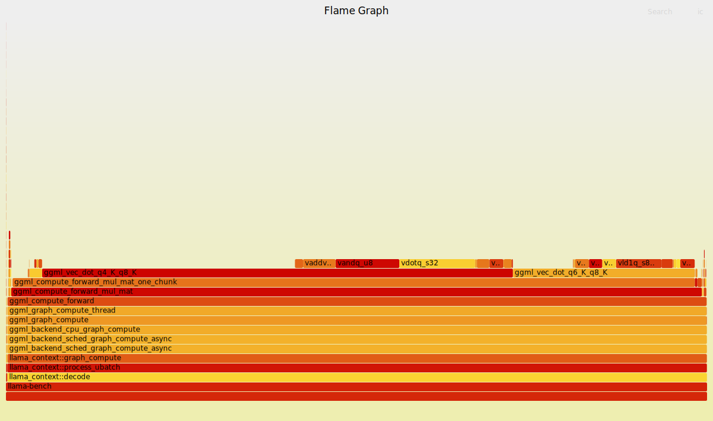
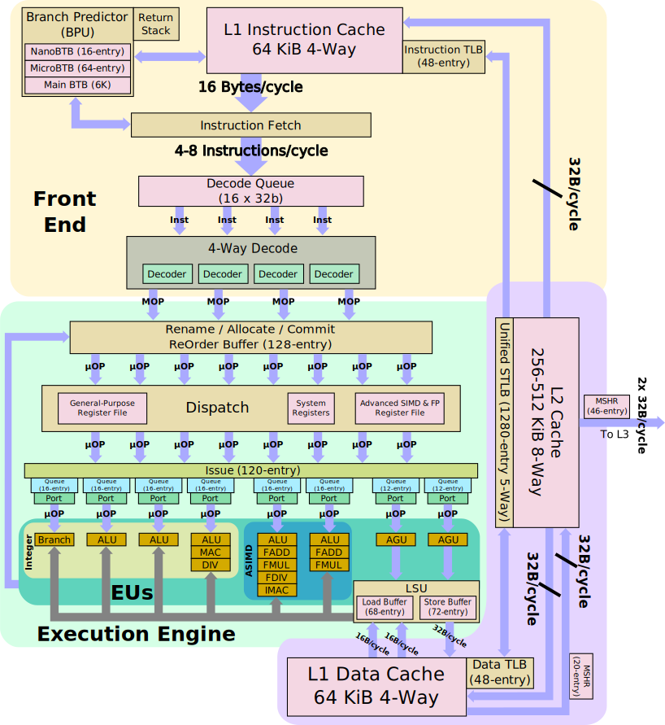

# ggml-neon-opt - Work In Progress
The goal of this repository is to optimize the ggml library for ARM Neon processors and achieve as high of a performance as I can on my Raspberry Pi 5. I hope to learn more about ML, and enjoy doing more with my Raspberry Pi.
My Raspberry Pi 5 is a 4 core ARM Cortex-A76 with 16GB of RAM. Cores 2 and 3 are isolated. This documentation is not an exact representation of my workflow, was much written retrospectively in the interest of making this more readable.


## Getting Started
### Prerequisites
Make sure to have arm neon and `sudo apt install build-essential linux-tools-$(uname -r) linux-perf libopenblas-dev libcurl4-openssl-dev libomp-dev wget`

### Cloning the Repoistory
```bash
git clone --recursive git@github.com:george-tyler-315-incline/ggml-neon-opt.git
cd ggml-neon-opt
# If you forgot --recursive:
# git submodule update --init --recursive
```
This project uses llama.cpp as a submodule. For detailed build instructions, see the [llama.cpp build documentation](external/llama.cpp/docs/build.md).

### Download a Simple model
```bash
mkdir -p models
wget https://huggingface.co/TheBloke/TinyLlama-1.1B-Chat-v1.0-GGUF/resolve/main/tinyllama-1.1b-chat-v1.0.Q4_K_M.gguf -O models/tinyllama-1.1b-chat-v1.0.Q4_K_M.gguf
```

## My Journey
### Initial Investigations and Gaining Repo Familiarity
I can perform a basic build to familiarize myself with the repo.
```bash
cmake -S external/llama.cpp -B external/llama.cpp/build \
  -DCMAKE_BUILD_TYPE=RelWithDebInfo \
  -DGGML_NATIVE=ON \
  -DGGML_BLAS=OFF \
  -DGGML_OPENMP=OFF \
  -DLLAMA_CURL=OFF \
  -DCMAKE_EXPORT_COMPILE_COMMANDS=ON
cmake --build external/llama.cpp/build --verbose
```

I am not super familiar with OpenMP, and so I want to understand it. I also am unsure whether I want it on initially when I profile. It seems building with GGML_OPENMP=ON enables my gcc -fopenmp flag, which links with OpenMP library and enables recognition of openmp pragma directives. I am not yet familiar with the codebase, but a quick search of the omp pragmas shows it seems to schedule `ggml_graph_compute_thread` to multiple threads when it is on.
```c
enum ggml_status ggml_graph_compute(struct ggml_cgraph * cgraph, struct ggml_cplan * cplan) {
...
#ifdef GGML_USE_OPENMP
    if (n_threads > 1) {
        #pragma omp parallel num_threads(n_threads)
        {
            #pragma omp single
            {
                // update the number of threads from the actual number of threads that we got from OpenMP
                n_threads = omp_get_num_threads();
                atomic_store_explicit(&threadpool->n_threads_cur, n_threads, memory_order_relaxed);
            }

            // Apply thread CPU mask and priority
            int ith = omp_get_thread_num();

            ggml_thread_apply_priority(threadpool->prio);
            if (ggml_thread_cpumask_is_valid(threadpool->workers[ith].cpumask)) {
                ggml_thread_apply_affinity(threadpool->workers[ith].cpumask);
            }
            ggml_graph_compute_thread(&threadpool->workers[ith]);
        }
    } else {
        atomic_store_explicit(&threadpool->n_threads_cur, 1, memory_order_relaxed);
        ggml_graph_compute_thread(&threadpool->workers[0]);
    }
#else
    if (n_threads > threadpool->n_threads_max) {
        GGML_LOG_WARN("cplan requested more threads (%d) than available (%d)\n", n_threads, threadpool->n_threads_max);
        n_threads = threadpool->n_threads_max;
    }

    // Kick all threads to start the new graph
    ggml_graph_compute_kickoff(threadpool, n_threads);

    // This is a work thread too
    ggml_graph_compute_thread(&threadpool->workers[0]);
#endif
...
}
```
I can build with and without OpenMP.
```bash
cmake -S external/llama.cpp -B external/llama.cpp/build_no_omp \
  -DCMAKE_BUILD_TYPE=RelWithDebInfo \
  -DGGML_NATIVE=ON \
  -DGGML_BLAS=ON \
  -DGGML_BLAS_VENDOR=OpenBLAS \
  -DGGML_OPENMP=OFF \
  -DLLAMA_CURL=OFF \
  -DCMAKE_EXPORT_COMPILE_COMMANDS=ON
cmake --build external/llama.cpp/build_no_omp --verbose

# Build with openmp
cmake -S external/llama.cpp -B external/llama.cpp/build_with_omp \
  -DCMAKE_BUILD_TYPE=RelWithDebInfo \
  -DGGML_NATIVE=ON \
  -DGGML_BLAS=ON \
  -DGGML_BLAS_VENDOR=OpenBLAS \
  -DGGML_OPENMP=ON \
  -DLLAMA_CURL=OFF \
  -DCMAKE_EXPORT_COMPILE_COMMANDS=ON
cmake --build external/llama.cpp/build_with_omp --verbose
```
I can run llama-bench under my favorite tool, gdb, with thread counts 1 and 2, with and without openmp. Inspecting backtraces on each thread confirms the picture. There is no visible difference with a single thread, clear parallelization using OpenMP with t=2 on the omp build, and clear parallelization without OpenMP with t=2 on the non-omp build. Note the GOMP_parallel() call in the output below.
```bash
brandonneway@raspberrypi:~/dev/transformers/ggml-neon-opt $ gdb --args ./external/llama.cpp/build_with_omp/bin/llama-bench -m models/tinyllama-1.1b-chat-v1.0.Q4_K_M.gguf  -p 512 -n 128 -t 2

# I am writing this partially retrospectively, and I found ggml_vec_dot_q4_K_q8_K as a clear hotspot using a perf run of llama-bench t=1 using a basic build.
(gdb) b ggml_vec_dot_q4_K_q8_K
Function "ggml_vec_dot_q4_K_q8_K" not defined.
Make breakpoint pending on future shared library load? (y or [n]) y
Breakpoint 1 (ggml_vec_dot_q4_K_q8_K) pending.
(gdb) r
...
Thread 1 "llama-bench" hit Breakpoint 1, ggml_vec_dot_q4_K_q8_K (n=2048, s=0x7fffffff9988, bs=0, vx=0x7fffe6dbc080, bx=0, vy=0x7ffff343c010, by=0, nrc=1)
    at /home/brandonneway/dev/transformers/ggml-neon-opt/external/llama.cpp/ggml/src/ggml-cpu/arch/arm/quants.c:2059
2059	    const block_q4_K * GGML_RESTRICT x = vx;
(gdb) info threads
  Id   Target Id                                      Frame
* 1    Thread 0x7ffff613c040 (LWP 3210) "llama-bench" ggml_vec_dot_q4_K_q8_K (n=2048, s=0x7fffffff9988, bs=0, vx=0x7fffe6dbc080, bx=0, vy=0x7ffff343c010, by=0, nrc=1)
    at /home/brandonneway/dev/transformers/ggml-neon-opt/external/llama.cpp/ggml/src/ggml-cpu/arch/arm/quants.c:2059
  2    Thread 0x7ffff612c0c0 (LWP 3212) "llama-bench" 0x00007ffff78ae834 in __futex_abstimed_wait_common64 (private=0, cancel=true, abstime=0x0, op=393, expected=0,
    futex_word=0x7ffff766796c) at ./nptl/futex-internal.c:57
  3    Thread 0x7fffc47c00c0 (LWP 3213) "llama-bench" ggml_vec_dot_q4_K_q8_K (n=2048, s=0x7fffc47bf574, bs=0, vx=0x7fffe6dcdc00, bx=0, vy=0x7ffff343c010, by=0, nrc=1)
    at /home/brandonneway/dev/transformers/ggml-neon-opt/external/llama.cpp/ggml/src/ggml-cpu/arch/arm/quants.c:2062
(gdb) thread apply all bt

Thread 3 (Thread 0x7fffc47c00c0 (LWP 3213) "llama-bench"):
#0  ggml_vec_dot_q4_K_q8_K (n=2048, s=0x7fffc47bf574, bs=0, vx=0x7fffe6dcdc00, bx=0, vy=0x7ffff343c010, by=0, nrc=1) at /home/brandonneway/dev/transformers/ggml-neon-opt/external/llama.cpp/ggml/src/ggml-cpu/arch/arm/quants.c:2062
#1  0x00007ffff771f814 in ggml_compute_forward_mul_mat_one_chunk (ir1_end=1, ir1_start=<optimized out>, ir0_end=128, ir0_start=64, num_rows_per_vec_dot=<optimized out>, type=<optimized out>, dst=<optimized out>, params=0x7fffc47bf7b0) at /home/brandonneway/dev/transformers/ggml-neon-opt/external/llama.cpp/ggml/src/ggml-cpu/ggml-cpu.c:1194
#2  ggml_compute_forward_mul_mat (params=params@entry=0x7fffc47bf7b0, dst=dst@entry=0x555555b7ca20) at /home/brandonneway/dev/transformers/ggml-neon-opt/external/llama.cpp/ggml/src/ggml-cpu/ggml-cpu.c:1389
#3  0x00007ffff77200bc in ggml_compute_forward (tensor=0x555555b7ca20, params=0x7fffc47bf7b0) at /home/brandonneway/dev/transformers/ggml-neon-opt/external/llama.cpp/ggml/src/ggml-cpu/ggml-cpu.c:1784
#4  ggml_graph_compute_thread (data=0x5555555fc4d0) at /home/brandonneway/dev/transformers/ggml-neon-opt/external/llama.cpp/ggml/src/ggml-cpu/ggml-cpu.c:2883
#5  0x00007ffff768ae9c in ?? () from /lib/aarch64-linux-gnu/libgomp.so.1
#6  0x00007ffff78b2030 in start_thread (arg=0x0) at ./nptl/pthread_create.c:442
#7  0x00007ffff791bf5c in thread_start () at ../sysdeps/unix/sysv/linux/aarch64/clone.S:79

Thread 2 (Thread 0x7ffff612c0c0 (LWP 3212) "llama-bench"):
#0  0x00007ffff78ae834 in __futex_abstimed_wait_common64 (private=0, cancel=true, abstime=0x0, op=393, expected=0, futex_word=0x7ffff766796c) at ./nptl/futex-internal.c:57
#1  __futex_abstimed_wait_common (cancel=true, private=0, abstime=0x0, clockid=0, expected=0, futex_word=0x7ffff766796c) at ./nptl/futex-internal.c:87
#2  __GI___futex_abstimed_wait_cancelable64 (futex_word=futex_word@entry=0x7ffff766796c, expected=expected@entry=0, clockid=clockid@entry=0, abstime=abstime@entry=0x0, private=private@entry=0) at ./nptl/futex-internal.c:139
#3  0x00007ffff78b1388 in __pthread_cond_wait_common (abstime=0x0, clockid=0, mutex=0x7ffff7667910, cond=0x7ffff7667940) at ./nptl/pthread_cond_wait.c:503
#4  ___pthread_cond_wait (cond=0x7ffff7667940, mutex=0x7ffff7667910) at ./nptl/pthread_cond_wait.c:618
#5  0x00007ffff650f208 in ?? () from /lib/aarch64-linux-gnu/libopenblas.so.0
#6  0x00007ffff78b2030 in start_thread (arg=0x0) at ./nptl/pthread_create.c:442
#7  0x00007ffff791bf5c in thread_start () at ../sysdeps/unix/sysv/linux/aarch64/clone.S:79

Thread 1 (Thread 0x7ffff613c040 (LWP 3210) "llama-bench"):
#0  ggml_vec_dot_q4_K_q8_K (n=2048, s=0x7fffffff9988, bs=0, vx=0x7fffe6dbc080, bx=0, vy=0x7ffff343c010, by=0, nrc=1) at /home/brandonneway/dev/transformers/ggml-neon-opt/external/llama.cpp/ggml/src/ggml-cpu/arch/arm/quants.c:2059
#1  0x00007ffff771f814 in ggml_compute_forward_mul_mat_one_chunk (ir1_end=1, ir1_start=<optimized out>, ir0_end=64, ir0_start=0, num_rows_per_vec_dot=<optimized out>, type=<optimized out>, dst=<optimized out>, params=0x7fffffff9bc0) at /home/brandonneway/dev/transformers/ggml-neon-opt/external/llama.cpp/ggml/src/ggml-cpu/ggml-cpu.c:1194
#2  ggml_compute_forward_mul_mat (params=params@entry=0x7fffffff9bc0, dst=dst@entry=0x555555b7ca20) at /home/brandonneway/dev/transformers/ggml-neon-opt/external/llama.cpp/ggml/src/ggml-cpu/ggml-cpu.c:1389
#3  0x00007ffff77200bc in ggml_compute_forward (tensor=0x555555b7ca20, params=0x7fffffff9bc0) at /home/brandonneway/dev/transformers/ggml-neon-opt/external/llama.cpp/ggml/src/ggml-cpu/ggml-cpu.c:1784
#4  ggml_graph_compute_thread (data=0x5555555fc2c0) at /home/brandonneway/dev/transformers/ggml-neon-opt/external/llama.cpp/ggml/src/ggml-cpu/ggml-cpu.c:2883
#5  0x00007ffff7683744 in GOMP_parallel () from /lib/aarch64-linux-gnu/libgomp.so.1
#6  0x00007ffff77220d4 in ggml_graph_compute (cgraph=0x555555e01c68, cplan=0x7fffffff9ed0) at /home/brandonneway/dev/transformers/ggml-neon-opt/external/llama.cpp/ggml/src/ggml-cpu/ggml-cpu.c:3156
#7  0x00007ffff77224c4 in ggml_backend_cpu_graph_compute (backend=<optimized out>, cgraph=0x555555e01c68) at /home/brandonneway/dev/transformers/ggml-neon-opt/external/llama.cpp/ggml/src/ggml-cpu/ggml-cpu.cpp:186
#8  0x00007ffff7d37fbc in ggml_backend_sched_compute_splits (sched=0x555555b1f510) at /home/brandonneway/dev/transformers/ggml-neon-opt/external/llama.cpp/ggml/src/ggml-backend.cpp:1553
#9  ggml_backend_sched_graph_compute_async (sched=0x555555b1f510, graph=<optimized out>) at /home/brandonneway/dev/transformers/ggml-neon-opt/external/llama.cpp/ggml/src/ggml-backend.cpp:1753
#10 0x00007ffff7e588cc in llama_context::graph_compute (this=this@entry=0x5555555fd830, gf=0x555555b22940, batched=<optimized out>) at /usr/include/c++/12/bits/unique_ptr.h:191
#11 0x00007ffff7e59674 in llama_context::process_ubatch (this=this@entry=0x5555555fd830, ubatch=..., gtype=gtype@entry=LLM_GRAPH_TYPE_DECODER, mctx=mctx@entry=0x5555555e2ce0, ret=@0x7fffffffe094: 32767) at /home/brandonneway/dev/transformers/ggml-neon-opt/external/llama.cpp/src/llama-graph.h:477
#12 0x00007ffff7e5f278 in llama_context::decode (this=0x5555555fd830, batch_inp=...) at /home/brandonneway/dev/transformers/ggml-neon-opt/external/llama.cpp/src/llama-context.cpp:1088
#13 0x00007ffff7e5ffb4 in llama_decode (ctx=<optimized out>, batch=...) at /home/brandonneway/dev/transformers/ggml-neon-opt/external/llama.cpp/src/llama-context.cpp:2747
#14 0x00005555555660a0 in test_prompt (ctx=ctx@entry=0x5555555fd830, n_prompt=512, n_batch=2048, n_threads=<optimized out>) at /home/brandonneway/dev/transformers/ggml-neon-opt/external/llama.cpp/tools/llama-bench/llama-bench.cpp:1939
#15 0x0000555555562040 in main (argc=<optimized out>, argv=<optimized out>) at /home/brandonneway/dev/transformers/ggml-neon-opt/external/llama.cpp/tools/llama-bench/llama-bench.cpp:2115
```
Having increased clarity, I will continue profiling with OpenMP enabled.
```bash
cmake -S external/llama.cpp -B external/llama.cpp/build \
  -DCMAKE_BUILD_TYPE=RelWithDebInfo \
  -DGGML_NATIVE=ON \
  -DGGML_BLAS=ON \
  -DGGML_BLAS_VENDOR=OpenBLAS \
  -DGGML_OPENMP=ON \
  -DLLAMA_CURL=OFF \
  -DCMAKE_EXPORT_COMPILE_COMMANDS=ON
cmake --build external/llama.cpp/build --verbose
```

### Initial GGML Profiling on the Pi with Intel TMA Method
I will start with an initial benchmark T₀ of GGML with TinyLlama using 512 tokens for the prompt, 128 tokens for the generation, and one thread. I will it on an isolated core.
```bash
# T₀
brandonneway@raspberrypi:~/dev/transformers/ggml-neon-opt $ taskset -c 2 ./external/llama.cpp/build/bin/llama-bench -m models/tinyllama-1.1b-chat-v1.0.Q4_K_M.gguf  -p 512 -n 128 -t 1
| model                          |       size |     params | backend    | threads |            test |                  t/s |
| ------------------------------ | ---------: | ---------: | ---------- | ------: | --------------: | -------------------: |
| llama 1B Q4_K - Medium         | 636.18 MiB |     1.10 B | BLAS       |       1 |           pp512 |         14.87 ± 0.03 |
| llama 1B Q4_K - Medium         | 636.18 MiB |     1.10 B | BLAS       |       1 |           tg128 |          8.85 ± 0.09 |

build: a3cb0474 (6735)
```

I like to start by collecting initial performance measurements with perf. These include CPU time, and a handful inspired from Intel Top-Down Microarchitecture Analysis Method. For Cortex A-76, the relevant PMU events (https://developer.arm.com/documentation/100798/0401/Performance-Monitoring-Unit/PMU-events) are instructions_retired, instructions_speculated, branch_misspredictions, frontend_stalls, backend_stalls, and cycles. This covers the various categories the program can be underperforming (https://easyperf.net/blog/2019/02/09/Top-Down-performance-analysis-methodology).

```bash
brandonneway@raspberrypi:~/dev/transformers/ggml-neon-opt $ sudo perf stat --delay 500 -e inst_retired,inst_spec,br_mis_pred,stall_frontend,stall_backend,cycles taskset -c 2 ./external/llama.cpp/build/bin/llama-bench -m models/tinyllama-1.1b-chat-v1.0.Q4_K_M.gguf -p 0 -n 128 -t 1
Events disabled
| model                          |       size |     params | backend    | threads |            test |                  t/s |
| ------------------------------ | ---------: | ---------: | ---------- | ------: | --------------: | -------------------: |
Events enabled
| llama 1B Q4_K - Medium         | 636.18 MiB |     1.10 B | BLAS       |       1 |           tg128 |          8.84 ± 0.02 |

build: a3cb0474 (6735)

 Performance counter stats for 'taskset -c 2 ./external/llama.cpp/build/bin/llama-bench -m models/tinyllama-1.1b-chat-v1.0.Q4_K_M.gguf -p 0 -n 128 -t 1':

   451,509,505,938      inst_retired
   453,000,663,833      inst_spec
        49,926,600      br_mis_pred
       289,684,332      stall_frontend
    25,793,958,956      stall_backend
   173,047,575,240      cycles

      72.183774322 seconds time elapsed

      72.587292000 seconds user
       0.023977000 seconds sys

brandonneway@raspberrypi:~/dev/transformers/ggml-neon-opt $ sudo perf stat --delay 500 -e br_mis_pred,br_retired taskset -c 2 ./external/llama.cpp/build/bin/llama-bench -m models/tinyllama-1.1b-chat-v1.0.Q4_K_M.gguf -p 0 -n 128 -t 1
Events disabled
| model                          |       size |     params | backend    | threads |            test |                  t/s |
| ------------------------------ | ---------: | ---------: | ---------- | ------: | --------------: | -------------------: |
Events enabled
| llama 1B Q4_K - Medium         | 636.18 MiB |     1.10 B | BLAS       |       1 |           tg128 |          8.79 ± 0.02 |

build: a3cb0474 (6735)

 Performance counter stats for 'taskset -c 2 ./external/llama.cpp/build/bin/llama-bench -m models/tinyllama-1.1b-chat-v1.0.Q4_K_M.gguf -p 0 -n 128 -t 1':

        49,802,353      br_mis_pred
    15,812,474,037      br_retired

      72.514991124 seconds time elapsed

      72.950628000 seconds user
       0.019988000 seconds sys


brandonneway@raspberrypi:~/dev/transformers/ggml-neon-opt $

brandonneway@raspberrypi:~/dev/transformers/ggml-neon-opt $ sudo perf record -e cycles -F 999 -g --call-graph=dwarf taskset -c 2 ./external/llama.cpp/build/bin/llama-bench -m models/tinyllama-1.1b-chat-v1.0.Q4_K_M.gguf -p 0 -n 128 -t 1
...
build: a3cb0474 (6735)
[ perf record: Woken up 2387 times to write data ]
[ perf record: Captured and wrote 596.778 MB perf.data (73234 samples) ]

brandonneway@raspberrypi:~/dev/transformers/ggml-neon-opt $ sudo perf report --stdio --no-children | head -150
...
# Overhead  Command      Shared Object          Symbol
...
    67.15%  llama-bench  libggml-cpu.so         [.] ggml_vec_dot_q4_K_q8_K
            |
            |--36.07%--ggml_vec_dot_q4_K_q8_K
            |          ggml_compute_forward_mul_mat_one_chunk (inlined)
            |          ggml_compute_forward_mul_mat
            |          ggml_compute_forward (inlined)
            |          ggml_graph_compute_thread (inlined)
            |          ggml_graph_compute
            |          ggml_backend_cpu_graph_compute(ggml_backend*, ggml_cgraph*)
            |          ggml_backend_sched_graph_compute_async
            |          ggml_backend_sched_graph_compute_async
            |          llama_context::graph_compute(ggml_cgraph*, bool)
            |          llama_context::process_ubatch(llama_ubatch const&, llm_graph_type, llama_memory_context_i*, ggml_status&)
            |          llama_context::decode(llama_batch const&)
            |
            |--10.82%--vdotq_s32 (inlined)
            |          ggml_vec_dot_q4_K_q8_K
            |          ggml_compute_forward_mul_mat_one_chunk (inlined)
            |          ggml_compute_forward_mul_mat
            |          ggml_compute_forward (inlined)
            |          ggml_graph_compute_thread (inlined)
            |          ggml_graph_compute
            |          ggml_backend_cpu_graph_compute(ggml_backend*, ggml_cgraph*)
            |          ggml_backend_sched_graph_compute_async
            |          ggml_backend_sched_graph_compute_async
            |          llama_context::graph_compute(ggml_cgraph*, bool)
            |          llama_context::process_ubatch(llama_ubatch const&, llm_graph_type, llama_memory_context_i*, ggml_status&)
            |          llama_context::decode(llama_batch const&)
            |
            |--9.09%--vandq_u8 (inlined)
            |          ggml_vec_dot_q4_K_q8_K
            |          ggml_compute_forward_mul_mat_one_chunk (inlined)
            |          ggml_compute_forward_mul_mat
            |          ggml_compute_forward (inlined)
            |          ggml_graph_compute_thread (inlined)
            |          ggml_graph_compute
            |          ggml_backend_cpu_graph_compute(ggml_backend*, ggml_cgraph*)
            |          ggml_backend_sched_graph_compute_async
            |          ggml_backend_sched_graph_compute_async
            |          llama_context::graph_compute(ggml_cgraph*, bool)
            |          llama_context::process_ubatch(llama_ubatch const&, llm_graph_type, llama_memory_context_i*, ggml_status&)
            |          llama_context::decode(llama_batch const&)
            |
            |--4.63%--vaddvq_s32 (inlined)
            |          ggml_vec_dot_q4_K_q8_K
            |          ggml_compute_forward_mul_mat_one_chunk (inlined)
            |          ggml_compute_forward_mul_mat
            |          ggml_compute_forward (inlined)
            |          ggml_graph_compute_thread (inlined)
            |          ggml_graph_compute
            |          ggml_backend_cpu_graph_compute(ggml_backend*, ggml_cgraph*)
            |          ggml_backend_sched_graph_compute_async
            |          ggml_backend_sched_graph_compute_async
            |          llama_context::graph_compute(ggml_cgraph*, bool)
            |          llama_context::process_ubatch(llama_ubatch const&, llm_graph_type, llama_memory_context_i*, ggml_status&)
            |          llama_context::decode(llama_batch const&)
            |
            |--1.99%--vld1q_u8_x2 (inlined)
            |          ggml_vec_dot_q4_K_q8_K
            |          ggml_compute_forward_mul_mat_one_chunk (inlined)
            |          ggml_compute_forward_mul_mat
            |          ggml_compute_forward (inlined)
            |          ggml_graph_compute_thread (inlined)
            |          ggml_graph_compute
            |          ggml_backend_cpu_graph_compute(ggml_backend*, ggml_cgraph*)
            |          ggml_backend_sched_graph_compute_async
            |          ggml_backend_sched_graph_compute_async
            |          llama_context::graph_compute(ggml_cgraph*, bool)
            |          llama_context::process_ubatch(llama_ubatch const&, llm_graph_type, llama_memory_context_i*, ggml_status&)
            |          llama_context::decode(llama_batch const&)
            |
            |--1.77%--vld1q_s8_x2 (inlined)
            |          ggml_vec_dot_q4_K_q8_K
            |          ggml_compute_forward_mul_mat_one_chunk (inlined)
            |          ggml_compute_forward_mul_mat
            |          ggml_compute_forward (inlined)
            |          ggml_graph_compute_thread (inlined)
            |          ggml_graph_compute
            |          ggml_backend_cpu_graph_compute(ggml_backend*, ggml_cgraph*)
            |          ggml_backend_sched_graph_compute_async
            |          ggml_backend_sched_graph_compute_async
            |          llama_context::graph_compute(ggml_cgraph*, bool)
            |          llama_context::process_ubatch(llama_ubatch const&, llm_graph_type, llama_memory_context_i*, ggml_status&)
            |          llama_context::decode(llama_batch const&)
            |
            |--1.15%--neon_compute_fp16_to_fp32 (inlined)
            |          ggml_vec_dot_q4_K_q8_K
            |          ggml_compute_forward_mul_mat_one_chunk (inlined)
            |          ggml_compute_forward_mul_mat
            |          ggml_compute_forward (inlined)
            |          ggml_graph_compute_thread (inlined)
            |          ggml_graph_compute
            |          ggml_backend_cpu_graph_compute(ggml_backend*, ggml_cgraph*)
            |          ggml_backend_sched_graph_compute_async
            |          ggml_backend_sched_graph_compute_async
            |          llama_context::graph_compute(ggml_cgraph*, bool)
            |          llama_context::process_ubatch(llama_ubatch const&, llm_graph_type, llama_memory_context_i*, ggml_status&)
            |          llama_context::decode(llama_batch const&)
            |
             --1.12%--vset_lane_u32 (inlined)
                       ggml_vec_dot_q4_K_q8_K
                       ggml_compute_forward_mul_mat_one_chunk (inlined)
                       ggml_compute_forward_mul_mat
                       ggml_compute_forward (inlined)
                       ggml_graph_compute_thread (inlined)
                       ggml_graph_compute
                       ggml_backend_cpu_graph_compute(ggml_backend*, ggml_cgraph*)
                       ggml_backend_sched_graph_compute_async
                       ggml_backend_sched_graph_compute_async
                       llama_context::graph_compute(ggml_cgraph*, bool)
                       llama_context::process_ubatch(llama_ubatch const&, llm_graph_type, llama_memory_context_i*, ggml_status&)
                       llama_context::decode(llama_batch const&)

    25.93%  llama-bench  libggml-cpu.so         [.] ggml_vec_dot_q6_K_q8_K
            |
            |--8.57%--ggml_vec_dot_q6_K_q8_K
            |          ggml_compute_forward_mul_mat_one_chunk (inlined)
            |          ggml_compute_forward_mul_mat
            |          ggml_compute_forward (inlined)
            |          ggml_graph_compute_thread (inlined)
            |          ggml_graph_compute
            |          ggml_backend_cpu_graph_compute(ggml_backend*, ggml_cgraph*)
            |          ggml_backend_sched_graph_compute_async
            |          ggml_backend_sched_graph_compute_async
            |          llama_context::graph_compute(ggml_cgraph*, bool)
            |          llama_context::process_ubatch(llama_ubatch const&, llm_graph_type, llama_memory_context_i*, ggml_status&)
            |          llama_context::decode(llama_batch const&)
            |
            |--6.48%--vld1q_s8_x4 (inlined)
            |          ggml_vec_dot_q6_K_q8_K
            |          ggml_compute_forward_mul_mat_one_chunk (inlined)
            |          ggml_compute_forward_mul_mat
            |          ggml_compute_forward (inlined)
            |          ggml_graph_compute_thread (inlined)
            |          ggml_graph_compute
            |          ggml_backend_cpu_graph_compute(ggml_backend*, ggml_cgraph*)
            |          ggml_backend_sched_graph_compute_async
            |          ggml_backend_sched_graph_compute_async
            |          llama_context::graph_compute(ggml_cgraph*, bool)

brandonneway@raspberrypi:~/dev/transformers/ggml-neon-opt $ sudo perf annotate --stdio --print-line --full-paths -s ggml_vec_dot_q4_K_q8_K --percent-limit 5

Sorted summary for file /home/brandonneway/dev/transformers/ggml-neon-opt/external/llama.cpp/build/bin/libggml-cpu.so
----------------------------------------------

   22.56 /home/brandonneway/dev/transformers/ggml-neon-opt/external/llama.cpp/ggml/src/ggml-cpu/arch/arm/quants.c:2345
   15.83 /usr/lib/gcc/aarch64-linux-gnu/12/include/arm_neon.h:29529
   14.73 /home/brandonneway/dev/transformers/ggml-neon-opt/external/llama.cpp/ggml/src/ggml-cpu/arch/arm/quants.c:2339
   13.54 /usr/lib/gcc/aarch64-linux-gnu/12/include/arm_neon.h:1122
    9.37 /home/brandonneway/dev/transformers/ggml-neon-opt/external/llama.cpp/ggml/src/ggml-cpu/arch/arm/quants.c:2307
    6.90 /usr/lib/gcc/aarch64-linux-gnu/12/include/arm_neon.h:9728
    2.97 /usr/lib/gcc/aarch64-linux-gnu/12/include/arm_neon.h:15441
    2.50 /usr/lib/gcc/aarch64-linux-gnu/12/include/arm_neon.h:15449
    1.67 /usr/lib/gcc/aarch64-linux-gnu/12/include/arm_neon.h:5667
    1.46 /home/brandonneway/dev/transformers/ggml-neon-opt/external/llama.cpp/ggml/src/ggml-cpu/arch/arm/quants.c:2302
    1.37 /home/brandonneway/dev/transformers/ggml-neon-opt/external/llama.cpp/ggml/src/ggml-cpu/simd-mappings.h:51
    1.21 /home/brandonneway/dev/transformers/ggml-neon-opt/external/llama.cpp/ggml/src/ggml-cpu/arch/arm/quants.c:2300
    0.76 /home/brandonneway/dev/transformers/ggml-neon-opt/external/llama.cpp/ggml/src/ggml-cpu/arch/arm/quants.c:2326
    0.69 /home/brandonneway/dev/transformers/ggml-neon-opt/external/llama.cpp/ggml/src/ggml-cpu/arch/arm/quants.c:2348
 Percent |      Source code & Disassembly of /home/brandonneway/dev/transformers/ggml-neon-opt/external/llama.cpp/build/bin/libggml-cpu.so for cycles (49195 samples, percent: loca>
----------------------------------------------------------------------------------------------------------------------------------------------------------------------------------->
         :
         :
         :
         : 3     Disassembly of section .text:
         :
         : 5     000000000005b980 <ggml_vec_dot_q4_K_q8_K>:
         : 6     UNUSED(bs);
         :
         : 8     const block_q4_K * GGML_RESTRICT x = vx;
         : 9     const block_q8_K * GGML_RESTRICT y = vy;
         :
         : 11    const int nb = n / QK_K;
    0.00 :   5b980:  cmp     w0, #0x0
    0.00 :   5b984:  add     w15, w0, #0xff
    0.00 :   5b988:  csel    w15, w15, w0, lt        // lt = tstop
         : 15    ggml_int8x16x2_t q4bytes;
         : 16    ggml_int8x16x2_t q8bytes;
         :
         : 18    float sumf = 0;
         :
         : 20    for (int i = 0; i < nb; ++i) {
    0.00 :   5b98c:  cmp     w0, #0xff
    0.02 :   5b990:  b.le    5baec <ggml_vec_dot_q4_K_q8_K+0x16c>
         : 23    float sumf = 0;
    0.36 :   5b994:  movi    v4.2s, #0x0
         :
         : 26    __extension__ extern __inline uint8x16_t
         : 27    __attribute__ ((__always_inline__, __gnu_inline__, __artificial__))
         : 28    vandq_u8 (uint8x16_t __a, uint8x16_t __b)
         : 29    {
         : 30    return __a & __b;
    0.00 :   5b998:  movi    v7.16b, #0xf
         : 32    void ggml_vec_dot_q4_K_q8_K(int n, float * GGML_RESTRICT s, size_t bs, const void * GGML_RESTRICT vx, size_t bx, const void * GGML_RESTRICT vy, size_t by, int nrc>
    0.01 :   5b99c:  sub     sp, sp, #0x10
         :
         : 35    __extension__ extern __inline int32x4_t
         : 36    __attribute__ ((__always_inline__, __gnu_inline__, __artificial__))
         : 37    vdotq_s32 (int32x4_t __r, int8x16_t __a, int8x16_t __b)
         : 38    {
         : 39    return __builtin_aarch64_sdot_prodv16qi (__a, __b, __r);
    0.00 :   5b9a0:  movi    v6.4s, #0x0
    0.00 :   5b9a4:  asr     w15, w15, #8
    0.00 :   5b9a8:  add     x11, x5, #0x4
    0.00 :   5b9ac:  add     x7, x3, #0x90
         : 44    for (int i = 0; i < nb; ++i) {
    0.02 :   5b9b0:  mov     w13, #0x0                       // #0
    0.15 :   5b9b4:  mov     x14, sp
    0.00 :   5b9b8:  nop
    0.02 :   5b9bc:  nop
         : 49    const float d = y[i].d * GGML_CPU_FP16_TO_FP32(x[i].d);
         : 50    const float dmin = y[i].d * GGML_CPU_FP16_TO_FP32(x[i].dmin);
         :
         : 52    const int16x8_t q8sums = vpaddq_s16(vld1q_s16(y[i].bsums), vld1q_s16(y[i].bsums + 8));
         :
         : 54    memcpy(utmp, x[i].scales, 12);
    0.87 :   5b9c0:  ldur    x2, [x7, #-140] // /home/brandonneway/dev/transformers/ggml-neon-opt/external/llama.cpp/ggml/src/ggml-cpu/arch/arm/quants.c:2307
    2.48 :   5b9c4:  mov     x6, x11
         : 57    vmull_s16(vget_high_s16(q8sums), vget_high_s16(mins)));
         : 58    sumf -= dmin * vaddvq_s32(prod);
         :
         : 60    const uint8_t * scales = (const uint8_t *)utmp;
         :
         : 62    const uint8_t * GGML_RESTRICT q4 = x[i].qs;
    0.01 :   5b9c8:  sub     x5, x7, #0x80
    0.01 :   5b9cc:  mov     x3, x14
         : 65    const int8_t  * GGML_RESTRICT q8 = y[i].qs;
         :
         : 67    int32_t sumi1 = 0;
         : 68    int32_t sumi2 = 0;
    0.02 :   5b9d0:  mov     w8, #0x0                        // #0
         : 70    memcpy(utmp, x[i].scales, 12);
    0.01 :   5b9d4:  ldur    w10, [x7, #-132]
         : 72    int32_t sumi1 = 0;
    0.76 :   5b9d8:  mov     w4, #0x0                        // #0 // /home/brandonneway/dev/transformers/ggml-neon-opt/external/llama.cpp/ggml/src/ggml-cpu/arch/arm/quants.c:2326
         : 74    return __builtin_aarch64_ld1v8hi ((const __builtin_aarch64_simd_hi *) __a);
    0.36 :   5b9dc:  ldp     q3, q1, [x11, #256]
         : 76    memcpy(utmp, x[i].scales, 12);
    6.03 :   5b9e0:  lsr     x0, x2, #32 // /home/brandonneway/dev/transformers/ggml-neon-opt/external/llama.cpp/ggml/src/ggml-cpu/arch/arm/quants.c:2307
         : 78    utmp[1] = (utmp[2] & kmask2) | (((utmp[0] >> 6) & kmask3) << 4);
    0.06 :   5b9e4:  lsr     w9, w2, #2
         : 80    mins8 = vset_lane_u32(((utmp[2] >> 4) & kmask2) | (((utmp[1] >> 6) & kmask3) << 4), mins8, 1);
    0.00 :   5b9e8:  lsr     w12, w0, #2
         : 82    mins8 = vset_lane_u32(utmp[1] & kmask1, mins8, 0);
    0.00 :   5b9ec:  and     w0, w0, #0x3f3f3f3f
         : 84    #define GGML_CPU_FP16_TO_FP32(x) GGML_CPU_COMPUTE_FP16_TO_FP32(x)
         :
         : 86    static inline float neon_compute_fp16_to_fp32(ggml_fp16_t h) {
         : 87    __fp16 tmp;
         : 88    memcpy(&tmp, &h, sizeof(ggml_fp16_t));
         : 89    return (float)tmp;
    0.00 :   5b9f0:  ldur    h2, [x7, #-142]
         : 91    mins8 = vset_lane_u32(((utmp[2] >> 4) & kmask2) | (((utmp[1] >> 6) & kmask3) << 4), mins8, 1);
    0.15 :   5b9f4:  lsr     w16, w10, #4
    0.02 :   5b9f8:  and     w12, w12, #0x30303030
         : 94    memcpy(utmp, x[i].scales, 12);
    0.03 :   5b9fc:  str     w10, [x14, #8]
         : 96    return __aarch64_vset_lane_any (__elem, __vec, __index);
    1.67 :   5ba00:  fmov    s0, w0 // /usr/lib/gcc/aarch64-linux-gnu/12/include/arm_neon.h:5667
         : 98    mins8 = vset_lane_u32(((utmp[2] >> 4) & kmask2) | (((utmp[1] >> 6) & kmask3) << 4), mins8, 1);
    0.05 :   5ba04:  and     w16, w16, #0xf0f0f0f
         : 100   utmp[1] = (utmp[2] & kmask2) | (((utmp[0] >> 6) & kmask3) << 4);
    0.01 :   5ba08:  and     w9, w9, #0x30303030
         : 102   mins8 = vset_lane_u32(((utmp[2] >> 4) & kmask2) | (((utmp[1] >> 6) & kmask3) << 4), mins8, 1);
    0.01 :   5ba0c:  orr     w12, w12, w16
         : 104   const float d = y[i].d * GGML_CPU_FP16_TO_FP32(x[i].d);
    0.00 :   5ba10:  ldur    s5, [x11, #-4]
         : 106   utmp[1] = (utmp[2] & kmask2) | (((utmp[0] >> 6) & kmask3) << 4);
    0.36 :   5ba14:  and     w10, w10, #0xf0f0f0f
         : 108   utmp[0] &= kmask1;
    0.02 :   5ba18:  and     w2, w2, #0x3f3f3f3f
         : 110   utmp[1] = (utmp[2] & kmask2) | (((utmp[0] >> 6) & kmask3) << 4);
    0.02 :   5ba1c:  orr     w0, w9, w10
    1.37 :   5ba20:  ldur    h20, [x7, #-144] // /home/brandonneway/dev/transformers/ggml-neon-opt/external/llama.cpp/ggml/src/ggml-cpu/simd-mappings.h:51
    0.09 :   5ba24:  fcvt    s2, h2
    0.01 :   5ba28:  stp     w2, w0, [sp]
         : 115   return __builtin_aarch64_addpv8hi (__a, __b);
    0.01 :   5ba2c:  addp    v3.8h, v3.8h, v1.8h
         : 117   return __aarch64_vset_lane_any (__elem, __vec, __index);
    0.00 :   5ba30:  mov     v0.s[1], w12
    0.26 :   5ba34:  fcvt    s20, h20
         : 120   const float dmin = y[i].d * GGML_CPU_FP16_TO_FP32(x[i].dmin);
    0.02 :   5ba38:  fmul    s2, s2, s5
         : 122   const float d = y[i].d * GGML_CPU_FP16_TO_FP32(x[i].d);
    1.46 :   5ba3c:  fmul    s20, s20, s5 // /home/brandonneway/dev/transformers/ggml-neon-opt/external/llama.cpp/ggml/src/ggml-cpu/arch/arm/quants.c:2302
         : 124   return __builtin_aarch64_uxtlv8hi_uu (__a);
    0.10 :   5ba40:  uxtl    v0.8h, v0.8b
         : 126   return __builtin_aarch64_intrinsic_vec_smult_lo_v4hi (__a, __b);
    0.01 :   5ba44:  smull2  v1.4s, v3.8h, v0.8h
         : 128   return __a + __b;
    0.01 :   5ba48:  smlal   v1.4s, v3.4h, v0.4h
         : 130   return __builtin_aarch64_reduc_plus_scal_v4si (__a);
    0.00 :   5ba4c:  addv    s0, v1.4s
         : 132   sumf -= dmin * vaddvq_s32(prod);
    0.21 :   5ba50:  scvtf   s0, s0
    0.03 :   5ba54:  fmsub   s21, s0, s2, s4
         : 135   return __builtin_aarch64_ld1x2v16qi (
    1.31 :   5ba58:  mov     x0, x6 // /usr/lib/gcc/aarch64-linux-gnu/12/include/arm_neon.h:15449
         : 137   return __builtin_aarch64_ld1x2v16qi_us (
    2.97 :   5ba5c:  ld1     {v0.16b, v1.16b}, [x5], #32 // /usr/lib/gcc/aarch64-linux-gnu/12/include/arm_neon.h:15441
         : 139   q4bytes.val[1] = vreinterpretq_s8_u8(vandq_u8  (q4bits.val[1], m4b));
         :
         : 141   const int32x4_t p1 = ggml_vdotq_s32(ggml_vdotq_s32(mzero, q4bytes.val[0], q8bytes.val[0]), q4bytes.val[1], q8bytes.val[1]);
         : 142   sumi1 += vaddvq_s32(p1) * scales[2*j+0];
         :
         : 144   q8bytes = ggml_vld1q_s8_x2(q8); q8 += 32;
   14.73 :   5ba60:  add     x6, x6, #0x40 // /home/brandonneway/dev/transformers/ggml-neon-opt/external/llama.cpp/ggml/src/ggml-cpu/arch/arm/quants.c:2339
         : 146   for (int j = 0; j < QK_K/64; ++j) {
    0.01 :   5ba64:  add     x3, x3, #0x2
         : 148   return __builtin_aarch64_ld1x2v16qi (
    0.14 :   5ba68:  ld1     {v4.16b, v5.16b}, [x0], #32
         : 150   q4bytes.val[0] = vreinterpretq_s8_u8(vshrq_n_u8(q4bits.val[0], 4));
         : 151   q4bytes.val[1] = vreinterpretq_s8_u8(vshrq_n_u8(q4bits.val[1], 4));
         :
         : 153   const int32x4_t p2 = ggml_vdotq_s32(ggml_vdotq_s32(mzero, q4bytes.val[0], q8bytes.val[0]), q4bytes.val[1], q8bytes.val[1]);
         :
         : 155   sumi2 += vaddvq_s32(p2) * scales[2*j+1];
   22.56 :   5ba6c:  ldurb   w9, [x3, #-1] // /home/brandonneway/dev/transformers/ggml-neon-opt/external/llama.cpp/ggml/src/ggml-cpu/arch/arm/quants.c:2345
         : 157   return __a & __b;
   12.10 :   5ba70:  and     v19.16b, v7.16b, v0.16b // /usr/lib/gcc/aarch64-linux-gnu/12/include/arm_neon.h:1122
         : 159   return __builtin_aarch64_lshrv16qi_uus (__a, __b);
    0.25 :   5ba74:  ushr    v18.16b, v0.16b, #4
         : 161   sumi1 += vaddvq_s32(p1) * scales[2*j+0];
    0.04 :   5ba78:  ldurb   w10, [x3, #-2]
         : 163   return __a & __b;
    1.44 :   5ba7c:  and     v17.16b, v7.16b, v1.16b
         : 165   return __builtin_aarch64_lshrv16qi_uus (__a, __b);
    0.00 :   5ba80:  ushr    v16.16b, v1.16b, #4
         : 167   return __builtin_aarch64_ld1x2v16qi (
    1.19 :   5ba84:  ld1     {v2.16b, v3.16b}, [x0] // /usr/lib/gcc/aarch64-linux-gnu/12/include/arm_neon.h:15449
         : 169   return __builtin_aarch64_sdot_prodv16qi (__a, __b, __r);
   14.70 :   5ba88:  mov     v1.16b, v6.16b // /usr/lib/gcc/aarch64-linux-gnu/12/include/arm_neon.h:29529
    1.13 :   5ba8c:  mov     v0.16b, v6.16b
    0.14 :   5ba90:  sdot    v1.4s, v19.16b, v4.16b
    0.01 :   5ba94:  sdot    v0.4s, v18.16b, v2.16b
    0.13 :   5ba98:  sdot    v1.4s, v17.16b, v5.16b
    0.00 :   5ba9c:  sdot    v0.4s, v16.16b, v3.16b
         : 176   return __builtin_aarch64_reduc_plus_scal_v4si (__a);
    1.14 :   5baa0:  addv    s1, v1.4s // /usr/lib/gcc/aarch64-linux-gnu/12/include/arm_neon.h:9728
    2.75 :   5baa4:  addv    s0, v0.4s
    1.80 :   5baa8:  fmov    w2, s1
    1.21 :   5baac:  fmov    w0, s0
    0.12 :   5bab0:  madd    w4, w10, w2, w4
         : 182   sumi2 += vaddvq_s32(p2) * scales[2*j+1];
    0.02 :   5bab4:  madd    w8, w9, w0, w8
         : 184   for (int j = 0; j < QK_K/64; ++j) {
    0.12 :   5bab8:  cmp     x5, x7
    0.00 :   5babc:  b.ne    5ba58 <ggml_vec_dot_q4_K_q8_K+0xd8>  // b.any
         : 187   }
         :
         : 189   sumf += d * (sumi1 + sumi2);
    0.69 :   5bac0:  add     w4, w4, w8 // /home/brandonneway/dev/transformers/ggml-neon-opt/external/llama.cpp/ggml/src/ggml-cpu/arch/arm/quants.c:2348
         : 191   for (int i = 0; i < nb; ++i) {
    0.54 :   5bac4:  add     w13, w13, #0x1 // /home/brandonneway/dev/transformers/ggml-neon-opt/external/llama.cpp/ggml/src/ggml-cpu/arch/arm/quants.c:2300
    0.50 :   5bac8:  add     x11, x11, #0x124
    0.03 :   5bacc:  add     x7, x7, #0x90
         : 195   sumf += d * (sumi1 + sumi2);
    0.02 :   5bad0:  scvtf   s0, w4
    0.03 :   5bad4:  fmadd   s4, s0, s20, s21
         : 198   for (int i = 0; i < nb; ++i) {
    0.00 :   5bad8:  cmp     w15, w13
    0.67 :   5badc:  b.gt    5b9c0 <ggml_vec_dot_q4_K_q8_K+0x40>
         :
         : 202   }
         :
         : 204   *s = sumf;
    0.25 :   5bae0:  str     s4, [x1]
         : 206   UNUSED(kmask2);
         : 207   UNUSED(kmask3);
         : 208   UNUSED(utmp);
         : 209   ggml_vec_dot_q4_K_q8_K_generic(n, s, bs, vx, bx, vy, by, nrc);
         : 210   #endif
         : 211   }
    0.14 :   5bae4:  add     sp, sp, #0x10
    0.00 :   5bae8:  ret
         : 214   float sumf = 0;
    0.00 :   5baec:  movi    v4.2s, #0x0
         : 216   *s = sumf;
    0.00 :   5baf0:  str     s4, [x1]
    0.00 :   5baf4:  ret
brandonneway@raspberrypi:~/dev/transformers/ggml-neon-opt $
```



So, clearly a lot of CPU time is being spent in `ggml_vec_dot_q4_K_q8_K`, with a bit over half of the time spent in the function itself and the rest of the time spent in the few functions it is calling.

#### Pipeline Slots
From the perf stat measurements, we can see 0.17% of cycles where there are no fetched instructions available to dispatch are stalled. This area, then, is not our biggest problem. We also see our branch mispredict rate per instruction retired is 0.01%, our branch mispredict rate per branch is 0.3%, and instructions discarded per cycle, (inst_spec - inst_retired)/cycles, is 0.0086. Bad speculation, then, does not seem to be an issue. On the other hand, examining backend performance, we see that for 15% of cycles, fetched instructions are not able to dispatch due to resource constaints (https://developer.arm.com/documentation/100798/0401/Performance-Monitoring-Unit/PMU-events). I next want to look more closely at measurements that can indicate why we are backend-bound.

But first, I want to know what the code is doing, and unfortunately there are a handful of preprocessor feature-based branches, so I gotta figure out exactly what is running and what isn't.
We can first see what is default defined:

```bash
brandonneway@raspberrypi:~/dev/transformers/ggml-neon-opt $ echo | gcc -march=native -E -dM - | grep -e 'ARM_FEATURE_' -e 'NEON' -e 'MATMUL'
#define __ARM_FEATURE_ATOMICS 1
#define __ARM_FEATURE_AES 1
#define __ARM_FEATURE_IDIV 1
#define __ARM_FEATURE_DOTPROD 1
#define __ARM_FEATURE_CRYPTO 1
#define __ARM_FEATURE_FP16_SCALAR_ARITHMETIC 1
#define __ARM_FEATURE_CLZ 1
#define __ARM_FEATURE_QRDMX 1
#define __ARM_FEATURE_FMA 1
#define __ARM_FEATURE_SHA2 1
#define __ARM_FEATURE_FP16_VECTOR_ARITHMETIC 1
#define __ARM_FEATURE_UNALIGNED 1
#define __ARM_FEATURE_CRC32 1
#define __ARM_NEON 1
#define __ARM_FEATURE_NUMERIC_MAXMIN 1
brandonneway@raspberrypi:~/dev/transformers/ggml-neon-opt $
```

So it seems we don't have SVE and we don't have MATMUL_I8. We can do a sanity check by seeing how the processor treats the source file. From `external/llama.cpp/build/compile_commands.json`:
```
{
  "directory": "/home/brandonneway/dev/transformers/ggml-neon-opt/external/llama.cpp/build/ggml/src",
  "command": "/usr/bin/cc -DGGML_BACKEND_BUILD -DGGML_BACKEND_SHARED -DGGML_SCHED_MAX_COPIES=4 -DGGML_SHARED -DGGML_USE_CPU_REPACK -DGGML_USE_LLAMAFILE -DGGML_USE_OPENMP -D_GNU_SOURCE -D_XOPEN_SOURCE=600 -Dggml_cpu_EXPORTS -I/home/brandonneway/dev/transformers/ggml-neon-opt/external/llama.cpp/ggml/src/.. -I/home/brandonneway/dev/transformers/ggml-neon-opt/external/llama.cpp/ggml/src/. -I/home/brandonneway/dev/transformers/ggml-neon-opt/external/llama.cpp/ggml/src/ggml-cpu -I/home/brandonneway/dev/transformers/ggml-neon-opt/external/llama.cpp/ggml/src/../include -O2 -g -DNDEBUG -fPIC -Wshadow -Wstrict-prototypes -Wpointer-arith -Wmissing-prototypes -Werror=implicit-int -Werror=implicit-function-declaration -Wall -Wextra -Wpedantic -Wcast-qual -Wno-unused-function -Wdouble-promotion -mcpu=cortex-a76+crypto+dotprod+noi8mm+nosve -fopenmp -std=gnu11 -o CMakeFiles/ggml-cpu.dir/ggml-cpu/arch/arm/quants.c.o -c /home/brandonneway/dev/transformers/ggml-neon-opt/external/llama.cpp/ggml/src/ggml-cpu/arch/arm/quants.c",
  "file": "/home/brandonneway/dev/transformers/ggml-neon-opt/external/llama.cpp/ggml/src/ggml-cpu/arch/arm/quants.c"
},
```
It seems `-mcpu=cortex-a76+crypto+dotprod+noi8mm+nosve` also confirms we don't have i8mm or sve. I will modify the command to dump the preprocessed file though via gcc -E.
```bash
brandonneway@raspberrypi:~/dev/transformers/ggml-neon-opt/external/llama.cpp/build/ggml/src $ /usr/bin/cc -DGGML_BACKEND_BUILD -DGGML_BACKEND_SHARED -DGGML_SCHED_MAX_COPIES=4 -DGGML_SHARED -DGGML_USE_CPU_REPACK -DGGML_USE_LLAMAFILE -DGGML_USE_OPENMP -D_GNU_SOURCE -D_XOPEN_SOURCE=600 -Dggml_cpu_EXPORTS -I/home/brandonneway/dev/transformers/ggml-neon-opt/external/llama.cpp/ggml/src/.. -I/home/brandonneway/dev/transformers/ggml-neon-opt/external/llama.cpp/ggml/src/. -I/home/brandonneway/dev/transformers/ggml-neon-opt/external/llama.cpp/ggml/src/ggml-cpu -I/home/brandonneway/dev/transformers/ggml-neon-opt/external/llama.cpp/ggml/src/../include -O2 -g -DNDEBUG -fPIC -Wshadow -Wstrict-prototypes -Wpointer-arith -Wmissing-prototypes -Werror=implicit-int -Werror=implicit-function-declaration -Wall -Wextra -Wpedantic -Wcast-qual -Wno-unused-function -Wdouble-promotion -mcpu=cortex-a76+crypto+dotprod+noi8mm+nosve -fopenmp -std=gnu11 -o ~/dev/transformers/ggml-neon-opt/preprocessed_arm_quants.c.txt -E /home/brandonneway/dev/transformers/ggml-neon-opt/external/llama.cpp/ggml/src/ggml-cpu/arch/arm/quants.c
```

<details>
  <summary><b>The preprocessed file reveals this as the source. Click to Expand</b></summary>

```c
void ggml_vec_dot_q4_K_q8_K(int n, float * restrict s, size_t bs, const void * restrict vx, size_t bx, const void * restrict vy, size_t by, int nrc) {

# 2127 "/home/brandonneway/dev/transformers/ggml-neon-opt/external/llama.cpp/ggml/src/ggml-cpu/arch/arm/quants.c" 3 4
   ((void) (0))
# 2127 "/home/brandonneway/dev/transformers/ggml-neon-opt/external/llama.cpp/ggml/src/ggml-cpu/arch/arm/quants.c"
                        ;


# 2131 "/home/brandonneway/dev/transformers/ggml-neon-opt/external/llama.cpp/ggml/src/ggml-cpu/arch/arm/quants.c" 3 4
   ((void) (0))
# 2131 "/home/brandonneway/dev/transformers/ggml-neon-opt/external/llama.cpp/ggml/src/ggml-cpu/arch/arm/quants.c"
                   ;

    (void)(nrc);
    (void)(bx);
    (void)(by);
    (void)(bs);

    const block_q4_K * restrict x = vx;
    const block_q8_K * restrict y = vy;

    const int nb = n / 256;

    static const uint32_t kmask1 = 0x3f3f3f3f;
    static const uint32_t kmask2 = 0x0f0f0f0f;
    static const uint32_t kmask3 = 0x03030303;

    uint32_t utmp[4];
# 2371 "/home/brandonneway/dev/transformers/ggml-neon-opt/external/llama.cpp/ggml/src/ggml-cpu/arch/arm/quants.c"
    const uint8x16_t m4b = vdupq_n_u8(0xf);
    const int32x4_t mzero = vdupq_n_s32(0);

    int8x16x2_t q4bytes;
    int8x16x2_t q8bytes;

    float sumf = 0;

    for (int i = 0; i < nb; ++i) {

        const float d = y[i].d * neon_compute_fp16_to_fp32(x[i].d);
        const float dmin = y[i].d * neon_compute_fp16_to_fp32(x[i].dmin);

        const int16x8_t q8sums = vpaddq_s16(vld1q_s16(y[i].bsums), vld1q_s16(y[i].bsums + 8));

        memcpy(utmp, x[i].scales, 12);

        uint32x2_t mins8 = { 0 };
        mins8 = vset_lane_u32(utmp[1] & kmask1, mins8, 0);
        mins8 = vset_lane_u32(((utmp[2] >> 4) & kmask2) | (((utmp[1] >> 6) & kmask3) << 4), mins8, 1);

        utmp[1] = (utmp[2] & kmask2) | (((utmp[0] >> 6) & kmask3) << 4);
        utmp[0] &= kmask1;

        const int16x8_t mins = vreinterpretq_s16_u16(vmovl_u8(vreinterpret_u8_u32(mins8)));
        const int32x4_t prod = vaddq_s32(vmull_s16(vget_low_s16 (q8sums), vget_low_s16 (mins)),
                                         vmull_s16(vget_high_s16(q8sums), vget_high_s16(mins)));
        sumf -= dmin * vaddvq_s32(prod);

        const uint8_t * scales = (const uint8_t *)utmp;

        const uint8_t * restrict q4 = x[i].qs;
        const int8_t * restrict q8 = y[i].qs;

        int32_t sumi1 = 0;
        int32_t sumi2 = 0;

        for (int j = 0; j < 256/64; ++j) {
            const uint8x16x2_t q4bits = vld1q_u8_x2(q4); q4 += 32;

            q8bytes = vld1q_s8_x2(q8); q8 += 32;
            q4bytes.val[0] = vreinterpretq_s8_u8(vandq_u8 (q4bits.val[0], m4b));
            q4bytes.val[1] = vreinterpretq_s8_u8(vandq_u8 (q4bits.val[1], m4b));

            const int32x4_t p1 = vdotq_s32(vdotq_s32(mzero, q4bytes.val[0], q8bytes.val[0]), q4bytes.val[1], q8bytes.val[1]);
            sumi1 += vaddvq_s32(p1) * scales[2*j+0];

            q8bytes = vld1q_s8_x2(q8); q8 += 32;
            q4bytes.val[0] = vreinterpretq_s8_u8(vshrq_n_u8(q4bits.val[0], 4));
            q4bytes.val[1] = vreinterpretq_s8_u8(vshrq_n_u8(q4bits.val[1], 4));

            const int32x4_t p2 = vdotq_s32(vdotq_s32(mzero, q4bytes.val[0], q8bytes.val[0]), q4bytes.val[1], q8bytes.val[1]);

            sumi2 += vaddvq_s32(p2) * scales[2*j+1];
        }

        sumf += d * (sumi1 + sumi2);

    }

    *s = sumf;
# 2490 "/home/brandonneway/dev/transformers/ggml-neon-opt/external/llama.cpp/ggml/src/ggml-cpu/arch/arm/quants.c"
}
```

</details>

Comparing with the original source file confirms the `__ARM_FEATURE_MATMUL_INT8` and `__ARM_FEATURE_SVE` branches were omitted and that the only branch hit is the section under `__ARM_NEON`.

#### Examining Backend

Back to profiling, I will look more closely at why performance is so backend-bound. I will collect some measurements that suggest the performance is core-bound and then some that suggest the performance is memory-bound.

##### Examining Core-Bound
Looking at speculative instructions for loads, stores, integer data-processing, advanced SIMD, and floating point processing, relative to total cycles provides evidence or for against execution unit saturation, one way a performance bottleneck is core-bound.

```bash
brandonneway@raspberrypi:~/dev/transformers/ggml-neon-opt $ sudo perf stat --delay 500 -e LD_SPEC,ST_SPEC,DP_SPEC,VFP_SPEC,ASE_SPEC,STALL_BACKEND,cycles  taskset -c 2 ./external/llama.cpp/build/bin/llama-bench -m models/tinyllama-1.1b-chat-v1.0.Q4_K_M.gguf -p 0 -n 128 -t 1
Events disabled
| model                          |       size |     params | backend    | threads |            test |                  t/s |
| ------------------------------ | ---------: | ---------: | ---------- | ------: | --------------: | -------------------: |
Events enabled
| llama 1B Q4_K - Medium         | 636.18 MiB |     1.10 B | BLAS       |       1 |           tg128 |          8.83 ± 0.01 |

build: a3cb0474 (6735)

 Performance counter stats for 'taskset -c 2 ./external/llama.cpp/build/bin/llama-bench -m models/tinyllama-1.1b-chat-v1.0.Q4_K_M.gguf -p 0 -n 128 -t 1':

    73,816,373,984      LD_SPEC
     6,420,251,582      ST_SPEC
   160,079,149,795      DP_SPEC
    20,234,922,631      VFP_SPEC
   176,495,748,475      ASE_SPEC
    26,071,714,673      STALL_BACKEND
   173,293,925,291      cycles

      72.261269041 seconds time elapsed

      72.692806000 seconds user
       0.019987000 seconds sys

```

I suppose evidence of execution-unit saturation might look like the instruction per cycle rate for a certain pipeline being larger than its max throughput. Maybe I am overthinking it, but I don't see it sufficient to simply divide these counts by cycles and compare to the number of pipelines that can serve that category, since not all the Cortex A76 pipelines are equivalent even for a given category. I think we can come up with a decent average-case estimate of pipeline utilization and if that does not appear to be cause for a bottleneck, then I am comfortable to say pipeline saturation is not a bottleneck.
For a given pipeline P, which can accept a new instruction each cycle, there is saturation if the instructions per cycle through P exceeds one. The average per cycle rate of instructions which go through P includes the instructions that can be executed by P and only P, along with the equally shared rate of instructions which can go through P and n other pipelines.

$$
\text{Utilization}_P = \sum_{\substack{
        i \in \\
            \text{instructions}\\
              \text{that can go}\\
              \text{through } P
    }} \frac{r_i}{n}, \quad m_i = \text{number of pipelines that can execute instruction } i, \quad r_i = \text{per-cycle rate of } i
$$

According to https://en.wikichip.org/wiki/arm_holdings/microarchitectures/cortex-a76#Execution_Units, there are two ASIMD/FP pipelines, three integer pipelines, and two load/store pipelines. The official Cortex A76 software optimization guide (https://developer.arm.com/documentation/pjdoc466751330-7215/latest/) gives more detail on each pipeline.

.


i will return to this

##### Examining Memory-Bound


more measurements...

```bash
brandonneway@raspberrypi:~/dev/transformers/ggml-neon-opt $ sudo perf stat --delay 500 -e L1D_CACHE,L1D_CACHE_REFILL,L2D_CACHE,L2D_CACHE_REFILL,cycles,STALL_BACKEND taskset -c 2 ./external/llama.cpp/build/bin/llama-bench -m models/tinyllama-1.1b-chat-v1.0.Q4_K_M.gguf -p 0 -n 128 -t 1
Events disabled
| model                          |       size |     params | backend    | threads |            test |                  t/s |
| ------------------------------ | ---------: | ---------: | ---------- | ------: | --------------: | -------------------: |
Events enabled
| llama 1B Q4_K - Medium         | 636.18 MiB |     1.10 B | BLAS       |       1 |           tg128 |          8.84 ± 0.02 |

build: a3cb0474 (6735)

 Performance counter stats for 'taskset -c 2 ./external/llama.cpp/build/bin/llama-bench -m models/tinyllama-1.1b-chat-v1.0.Q4_K_M.gguf -p 0 -n 128 -t 1':

   118,461,317,339      L1D_CACHE
       695,145,948      L1D_CACHE_REFILL
    13,118,245,162      L2D_CACHE
       332,089,576      L2D_CACHE_REFILL
   174,006,342,426      cycles
    25,948,760,386      STALL_BACKEND

      72.883211213 seconds time elapsed

      72.586759000 seconds user
       0.071951000 seconds sys


brandonneway@raspberrypi:~/dev/transformers/ggml-neon-opt $ sudo perf stat --delay 500 -e L3D_CACHE_RD,L3D_CACHE_REFILL,BUS_ACCESS_RD,BUS_ACCESS_WR,BUS_CYCLES,cycles taskset -c 2 ./external/llama.cpp/build/bin/llama-bench -m models/tinyllama-1.1b-chat-v1.0.Q4_K_M.gguf -p 0 -n 128 -t 1
Events disabled
| model                          |       size |     params | backend    | threads |            test |                  t/s |
| ------------------------------ | ---------: | ---------: | ---------- | ------: | --------------: | -------------------: |
Events enabled
| llama 1B Q4_K - Medium         | 636.18 MiB |     1.10 B | BLAS       |       1 |           tg128 |          8.60 ± 0.05 |

build: a3cb0474 (6735)

 Performance counter stats for 'taskset -c 2 ./external/llama.cpp/build/bin/llama-bench -m models/tinyllama-1.1b-chat-v1.0.Q4_K_M.gguf -p 0 -n 128 -t 1':

     6,528,096,251      L3D_CACHE_RD
     6,328,032,204      L3D_CACHE_REFILL
    26,112,411,218      BUS_ACCESS_RD
    26,118,910,342      BUS_ACCESS_WR
   177,902,410,214      BUS_CYCLES
   177,902,434,669      cycles

      74.177960150 seconds time elapsed

      74.607544000 seconds user
       0.023985000 seconds sys


brandonneway@raspberrypi:~/dev/transformers/ggml-neon-opt $ sudo perf stat --delay 500 -e MEM_ACCESS_RD,MEM_ACCESS_WR,LL_CACHE_MISS_RD,REMOTE_ACCESS,cycles  taskset -c 2 ./external/llama.cpp/build/bin/llama-bench -m models/tinyllama-1.1b-chat-v1.0.Q4_K_M.gguf -p 0 -n 128 -t 1
Events disabled
| model                          |       size |     params | backend    | threads |            test |                  t/s |
| ------------------------------ | ---------: | ---------: | ---------- | ------: | --------------: | -------------------: |
Events enabled
| llama 1B Q4_K - Medium         | 636.18 MiB |     1.10 B | BLAS       |       1 |           tg128 |          8.70 ± 0.04 |

build: a3cb0474 (6735)

 Performance counter stats for 'taskset -c 2 ./external/llama.cpp/build/bin/llama-bench -m models/tinyllama-1.1b-chat-v1.0.Q4_K_M.gguf -p 0 -n 128 -t 1':

   111,179,627,116      MEM_ACCESS_RD
     6,642,929,868      MEM_ACCESS_WR
     6,340,630,955      LL_CACHE_MISS_RD
                 0      REMOTE_ACCESS
   175,841,658,671      cycles

      73.314054184 seconds time elapsed

      73.746620000 seconds user
       0.023986000 seconds sys


brandonneway@raspberrypi:~/dev/transformers/ggml-neon-opt $ sudo shutdown now

Broadcast message from root@raspberrypi on pts/0 (Mon 2025-11-10 21:56:08 PST):

The system will power off now!

brandonneway@raspberrypi:~/dev/transformers/ggml-neon-opt $ Connection to raspberrypi.local closed by remote host.
Connection to raspberrypi.local closed.
(base) λ ~/
(base) λ ~/
(base) λ ~/
(base) λ ~/
(base) λ ~/
(base) λ ~/
(base) λ ~/
(base) λ ~/
(base) λ ~/
(base) λ ~/
(base) λ ~/ ssh brandonneway@raspberrypi.local
Linux raspberrypi 6.12.34+rpt-rpi-2712 #1 SMP PREEMPT Debian 1:6.12.34-1+rpt1~bookworm (2025-06-26) aarch64

The programs included with the Debian GNU/Linux system are free software;
the exact distribution terms for each program are described in the
individual files in /usr/share/doc/*/copyright.

Debian GNU/Linux comes with ABSOLUTELY NO WARRANTY, to the extent
permitted by applicable law.
Last login: Mon Nov 10 21:56:17 2025
brandonneway@raspberrypi:~ $
brandonneway@raspberrypi:~ $ cd dev/transformers/ggml-neon-opt/
brandonneway@raspberrypi:~/dev/transformers/ggml-neon-opt $ ls
artifacts  external  LICENSE  models  perf.data  preprocessed_arm_quants.c.txt  README.md
brandonneway@raspberrypi:~/dev/transformers/ggml-neon-opt $ sudo perf stat --delay 500 -e L1D_CACHE,L1D_CACHE_RD,L1D_CACHE_WR,L1D_CACHE_REFILL,L1D_CACHE_REFILL_RD,L1D_CACHE_REFILL_WR,L1D_CACHE_REFILL_INNER,L1D_CACHE_REFILL_OUTER askset -c 2 ./external/llama.cpp/build/bin/llama-bench -m models/tinyllama-1.1b-chat-v1.0.Q4_K_M.gguf -p 0 -n 128 -t 1
Events disabled
Events enabled
Workload failed: No such file or directory
brandonneway@raspberrypi:~/dev/transformers/ggml-neon-opt $ sudo perf stat --delay 500 -e L1D_CACHE,L1D_CACHE_RD,L1D_CACHE_WR,L1D_CACHE_REFILL,L1D_CACHE_REFILL_RD,L1D_CACHE_REFILL_WR,L1D_CACHE_REFILL_INNER,L1D_CACHE_REFILL_OUTER taskset -c 2 ./external/llama.cpp/build/bin/llama-bench -m models/tinyllama-1.1b-chat-v1.0.Q4_K_M.gguf -p 0 -n 128 -t 1
Events disabled
| model                          |       size |     params | backend    | threads |            test |                  t/s |
| ------------------------------ | ---------: | ---------: | ---------- | ------: | --------------: | -------------------: |
Events enabled
| llama 1B Q4_K - Medium         | 636.18 MiB |     1.10 B | BLAS       |       1 |           tg128 |          8.83 ± 0.02 |

build: a3cb0474 (6735)

 Performance counter stats for 'taskset -c 2 ./external/llama.cpp/build/bin/llama-bench -m models/tinyllama-1.1b-chat-v1.0.Q4_K_M.gguf -p 0 -n 128 -t 1':

   118,357,216,203      L1D_CACHE                                                               (75.00%)
   111,832,981,523      L1D_CACHE_RD                                                            (74.99%)
     6,702,270,647      L1D_CACHE_WR                                                            (74.99%)
       693,783,690      L1D_CACHE_REFILL                                                        (75.01%)
       656,811,160      L1D_CACHE_REFILL_RD                                                     (75.01%)
        37,131,581      L1D_CACHE_REFILL_WR                                                     (75.00%)
       567,991,262      L1D_CACHE_REFILL_INNER                                                  (74.99%)
       126,560,501      L1D_CACHE_REFILL_OUTER                                                  (74.99%)

      72.949835165 seconds time elapsed

      72.601574000 seconds user
       0.083909000 seconds sys


brandonneway@raspberrypi:~/dev/transformers/ggml-neon-opt $ sudo perf stat --delay 500 -e L1D_CACHE,L1D_CACHE_RD,L1D_CACHE_WR,L1D_CACHE_REFILL,L1D_CACHE_REFILL_RD,L1D_CACHE_REFILL_WR taskset -c 2 ./external/llama.cpp/build/bin/llama-bench -m models/tinyllama-1.1b-chat-v1.0.Q4_K_M.gguf -p 0 -n 128 -t 1
Events disabled
| model                          |       size |     params | backend    | threads |            test |                  t/s |
| ------------------------------ | ---------: | ---------: | ---------- | ------: | --------------: | -------------------: |
Events enabled


| llama 1B Q4_K - Medium         | 636.18 MiB |     1.10 B | BLAS       |       1 |           tg128 |          8.79 ± 0.01 |

build: a3cb0474 (6735)

 Performance counter stats for 'taskset -c 2 ./external/llama.cpp/build/bin/llama-bench -m models/tinyllama-1.1b-chat-v1.0.Q4_K_M.gguf -p 0 -n 128 -t 1':

   117,866,278,011      L1D_CACHE
   111,219,203,977      L1D_CACHE_RD
     6,647,072,100      L1D_CACHE_WR
       701,933,983      L1D_CACHE_REFILL
       670,649,227      L1D_CACHE_REFILL_RD
        31,284,711      L1D_CACHE_REFILL_WR

      72.611524639 seconds time elapsed

      72.996497000 seconds user
       0.027968000 seconds sys


brandonneway@raspberrypi:~/dev/transformers/ggml-neon-opt $ sudo perf stat --delay 500 -e L1D_CACHE,L1D_CACHE_RD,L1D_CACHE_WR,L1D_CACHE_REFILL,L1D_CACHE_WB taskset -c 2 ./external/llama.cpp/build/bin/llama-bench -m models/tinyllama-1.1b-chat-v1.0.Q4_K_M.gguf -p 0 -n 128 -t 1
Events disabled
| model                          |       size |     params | backend    | threads |            test |                  t/s |
| ------------------------------ | ---------: | ---------: | ---------- | ------: | --------------: | -------------------: |
Events enabled
| llama 1B Q4_K - Medium         | 636.18 MiB |     1.10 B | BLAS       |       1 |           tg128 |          8.78 ± 0.03 |

build: a3cb0474 (6735)

 Performance counter stats for 'taskset -c 2 ./external/llama.cpp/build/bin/llama-bench -m models/tinyllama-1.1b-chat-v1.0.Q4_K_M.gguf -p 0 -n 128 -t 1':

   117,873,482,150      L1D_CACHE
   111,226,120,507      L1D_CACHE_RD
     6,647,359,075      L1D_CACHE_WR
       720,178,397      L1D_CACHE_REFILL
        57,481,472      L1D_CACHE_WB

      72.703296001 seconds time elapsed

      73.094244000 seconds user
       0.019976000 seconds sys


brandonneway@raspberrypi:~/dev/transformers/ggml-neon-opt $ sudo perf stat --delay 500 -e L1D_CACHE_REFILL,L1D_CACHE_REFILL_INNER,L1D_CACHE_REFILL_OUTER,cycles taskset -c 2 ./external/llama.cpp/build/bin/llama-bench -m models/tinyllama-1.1b-chat-v1.0.Q4_K_M.gguf -p 0 -n 128 -t 1
Events disabled
| model                          |       size |     params | backend    | threads |            test |                  t/s |
| ------------------------------ | ---------: | ---------: | ---------- | ------: | --------------: | -------------------: |
Events enabled
| llama 1B Q4_K - Medium         | 636.18 MiB |     1.10 B | BLAS       |       1 |           tg128 |          8.77 ± 0.04 |

build: a3cb0474 (6735)

 Performance counter stats for 'taskset -c 2 ./external/llama.cpp/build/bin/llama-bench -m models/tinyllama-1.1b-chat-v1.0.Q4_K_M.gguf -p 0 -n 128 -t 1':

       718,165,956      L1D_CACHE_REFILL
       569,261,662      L1D_CACHE_REFILL_INNER
       148,904,245      L1D_CACHE_REFILL_OUTER
   174,291,106,083      cycles

      72.708145456 seconds time elapsed

      73.107033000 seconds user
       0.019977000 seconds sys


brandonneway@raspberrypi:~/dev/transformers/ggml-neon-opt $
```

Taking a slightly different approach, I am going to modify the code to preserve the loads, but reduce the arithmetic NEON operations in the tight loop, to see if there is a speedup. If there is, it suggests the ASIMD pipelines were saturated.

```c
void ggml_vec_dot_q4_K_q8_K(int n, float * GGML_RESTRICT s, size_t bs, const void * GGML_RESTRICT vx, size_t bx, const void * GGML_RESTRICT vy, size_t by, int nrc) {
    //....
#elif defined __ARM_NEON
    const uint8x16_t m4b = vdupq_n_u8(0xf);
    const int32x4_t mzero = vdupq_n_s32(0);

    ggml_int8x16x2_t q4bytes;
    ggml_int8x16x2_t q8bytes;

    float sumf = 0;

    for (int i = 0; i < nb; ++i) {

        const float d = y[i].d * GGML_CPU_FP16_TO_FP32(x[i].d);
        const float dmin = y[i].d * GGML_CPU_FP16_TO_FP32(x[i].dmin);

        const int16x8_t q8sums = vpaddq_s16(vld1q_s16(y[i].bsums), vld1q_s16(y[i].bsums + 8));

        memcpy(utmp, x[i].scales, 12);

        uint32x2_t mins8 = { 0 };
        mins8 = vset_lane_u32(utmp[1] & kmask1, mins8, 0);
        mins8 = vset_lane_u32(((utmp[2] >> 4) & kmask2) | (((utmp[1] >> 6) & kmask3) << 4), mins8, 1);

        utmp[1] = (utmp[2] & kmask2) | (((utmp[0] >> 6) & kmask3) << 4);
        utmp[0] &= kmask1;

        const int16x8_t mins = vreinterpretq_s16_u16(vmovl_u8(vreinterpret_u8_u32(mins8)));
        const int32x4_t prod = vaddq_s32(vmull_s16(vget_low_s16 (q8sums), vget_low_s16 (mins)),
                                         vmull_s16(vget_high_s16(q8sums), vget_high_s16(mins)));
        sumf -= dmin * vaddvq_s32(prod);

        const uint8_t * scales = (const uint8_t *)utmp;

        const uint8_t * GGML_RESTRICT q4 = x[i].qs;
        const int8_t  * GGML_RESTRICT q8 = y[i].qs;

        int32_t sumi1 = 0;
        int32_t sumi2 = 0;

        volatile int bleh = 0;

        for (int j = 0; j < QK_K/64; ++j) {
            const ggml_uint8x16x2_t q4bits = ggml_vld1q_u8_x2(q4); q4 += 32;

            q8bytes = ggml_vld1q_s8_x2(q8); q8 += 32;
            // q4bytes.val[0] = vreinterpretq_s8_u8(vandq_u8  (q4bits.val[0], m4b));
            // q4bytes.val[1] = vreinterpretq_s8_u8(vandq_u8  (q4bits.val[1], m4b));

            bleh += vaddvq_u8(q4bits.val[0]) + vaddvq_u8(q4bits.val[1]);
            bleh += vaddvq_s8(q8bytes.val[0]) + vaddvq_s8(q8bytes.val[1]);

            // const int32x4_t p1 = ggml_vdotq_s32(ggml_vdotq_s32(mzero, q4bytes.val[0], q8bytes.val[0]), q4bytes.val[1], q8bytes.val[1]);
            // sumi1 += vaddvq_s32(p1) * scales[2*j+0];

            q8bytes = ggml_vld1q_s8_x2(q8); q8 += 32;
            // q4bytes.val[0] = vreinterpretq_s8_u8(vshrq_n_u8(q4bits.val[0], 4));
            // q4bytes.val[1] = vreinterpretq_s8_u8(vshrq_n_u8(q4bits.val[1], 4));

            // const int32x4_t p2 = ggml_vdotq_s32(ggml_vdotq_s32(mzero, q4bytes.val[0], q8bytes.val[0]), q4bytes.val[1], q8bytes.val[1]);

            // sumi2 += vaddvq_s32(p2) * scales[2*j+1];

            bleh += vaddvq_s8(q8bytes.val[0]) + vaddvq_s8(q8bytes.val[1]);
        }

        sumf += d * (sumi1 + sumi2) + bleh;

    }

    *s = sumf;
}
```

```bash
cmake -S external/llama.cpp -B external/llama.cpp/build_with_loads_but_less_neon \
  -DCMAKE_BUILD_TYPE=RelWithDebInfo \
  -DGGML_NATIVE=ON \
  -DGGML_BLAS=ON \
  -DGGML_BLAS_VENDOR=OpenBLAS \
  -DGGML_OPENMP=ON \
  -DLLAMA_CURL=OFF \
  -DCMAKE_EXPORT_COMPILE_COMMANDS=ON
taskset -c 1,2,3 cmake --build external/llama.cpp/build_with_loads_but_less_neon/ --verbose -j
...
sudo perf stat --delay 500 -e LD_SPEC,ST_SPEC,DP_SPEC,VFP_SPEC,ASE_SPEC,STALL_BACKEND,cycles  taskset -c 2 ./external/llama.cpp/build_with_loads_but_less_neon/bin/llama-bench -m models/tinyllama-1.1b-chat-v1.0.Q4_K_M.gguf -p 0 -n 128 -t 1
Events disabled
| model                          |       size |     params | backend    | threads |            test |                  t/s |
| ------------------------------ | ---------: | ---------: | ---------- | ------: | --------------: | -------------------: |
Events enabled
| llama 1B Q4_K - Medium         | 636.18 MiB |     1.10 B | BLAS       |       1 |           tg128 |          6.30 ± 0.01 |

build: a3cb0474 (6735)

 Performance counter stats for 'taskset -c 2 ./external/llama.cpp/build_with_loads_but_less_neon/bin/llama-bench -m models/tinyllama-1.1b-chat-v1.0.Q4_K_M.gguf -p 0 -n 128 -t 1':

    84,524,620,023      LD_SPEC
    33,969,802,140      ST_SPEC
   194,117,164,867      DP_SPEC
    22,540,688,609      VFP_SPEC
   134,048,178,563      ASE_SPEC
    39,609,092,086      STALL_BACKEND
   243,202,963,199      cycles

     101.381206602 seconds time elapsed

     101.808524000 seconds user
       0.031987000 seconds sys
```

Weirdly, the token generation is actually slower...so I will try another approach of preserving the ASIMD operations but removing the loads by using junk data. If this improves performance, it suggests memory bandwidth was a bottleneck.

```c
void ggml_vec_dot_q4_K_q8_K(int n, float * GGML_RESTRICT s, size_t bs, const void * GGML_RESTRICT vx, size_t bx, const void * GGML_RESTRICT vy, size_t by, int nrc) {
    //....
#elif defined __ARM_NEON
    const uint8x16_t m4b = vdupq_n_u8(0xf);
    const int32x4_t mzero = vdupq_n_s32(0);

    ggml_int8x16x2_t q4bytes;
    ggml_int8x16x2_t q8bytes;

    uint8_t dummy_q4[32];
    int8_t dummy_q8[32];
    
    // Initialize with junk
    memset(dummy_q4, 0x0F, 32);
    memset(dummy_q8, 0x01, 32);

    float sumf = 0;

    for (int i = 0; i < nb; ++i) {

        const float d = y[i].d * GGML_CPU_FP16_TO_FP32(x[i].d);
        const float dmin = y[i].d * GGML_CPU_FP16_TO_FP32(x[i].dmin);

        const int16x8_t q8sums = vpaddq_s16(vld1q_s16(y[i].bsums), vld1q_s16(y[i].bsums + 8));

        memcpy(utmp, x[i].scales, 12);

        uint32x2_t mins8 = { 0 };
        mins8 = vset_lane_u32(utmp[1] & kmask1, mins8, 0);
        mins8 = vset_lane_u32(((utmp[2] >> 4) & kmask2) | (((utmp[1] >> 6) & kmask3) << 4), mins8, 1);

        utmp[1] = (utmp[2] & kmask2) | (((utmp[0] >> 6) & kmask3) << 4);
        utmp[0] &= kmask1;

        const int16x8_t mins = vreinterpretq_s16_u16(vmovl_u8(vreinterpret_u8_u32(mins8)));
        const int32x4_t prod = vaddq_s32(vmull_s16(vget_low_s16 (q8sums), vget_low_s16 (mins)),
                                         vmull_s16(vget_high_s16(q8sums), vget_high_s16(mins)));
        sumf -= dmin * vaddvq_s32(prod);

        const uint8_t * scales = (const uint8_t *)utmp;

        const uint8_t * GGML_RESTRICT q4 = x[i].qs;
        const int8_t  * GGML_RESTRICT q8 = y[i].qs;

        int32_t sumi1 = 0;
        int32_t sumi2 = 0;

        for (int j = 0; j < QK_K/64; ++j) {
            const ggml_uint8x16x2_t q4bits = ggml_vld1q_u8_x2(dummy_q4); q4 += 32;

            q8bytes = ggml_vld1q_s8_x2(dummy_q8); q8 += 32;
            q4bytes.val[0] = vreinterpretq_s8_u8(vandq_u8  (q4bits.val[0], m4b));
            q4bytes.val[1] = vreinterpretq_s8_u8(vandq_u8  (q4bits.val[1], m4b));

            const int32x4_t p1 = ggml_vdotq_s32(ggml_vdotq_s32(mzero, q4bytes.val[0], q8bytes.val[0]), q4bytes.val[1], q8bytes.val[1]);
            sumi1 += vaddvq_s32(p1) * scales[2*j+0];

            q8bytes = ggml_vld1q_s8_x2(dummy_q8); q8 += 32;
            q4bytes.val[0] = vreinterpretq_s8_u8(vshrq_n_u8(q4bits.val[0], 4));
            q4bytes.val[1] = vreinterpretq_s8_u8(vshrq_n_u8(q4bits.val[1], 4));

            const int32x4_t p2 = ggml_vdotq_s32(ggml_vdotq_s32(mzero, q4bytes.val[0], q8bytes.val[0]), q4bytes.val[1], q8bytes.val[1]);

            sumi2 += vaddvq_s32(p2) * scales[2*j+1];
        }

        sumf += d * (sumi1 + sumi2);

    }

    *s = sumf;
}
```

This time, the token generation remained at the baseline value T0. 

```bash
udo perf stat --delay 500 -e LD_SPEC,ST_SPEC,DP_SPEC,VFP_SPEC,ASE_SPEC,STALL_BACKEND,cycles  taskset -c 2 ./external/llama.cpp/build_with_loads_but_less_neon/bin/llama-bench -m models/tinyllama-1.1b-chat-v1.0.Q4_K_M.gguf -p 0 -n 128 -t 1
Events disabled
| model                          |       size |     params | backend    | threads |            test |                  t/s |
| ------------------------------ | ---------: | ---------: | ---------- | ------: | --------------: | -------------------: |
Events enabled
| llama 1B Q4_K - Medium         | 636.18 MiB |     1.10 B | BLAS       |       1 |           tg128 |          8.60 ± 0.01 |

build: a3cb0474 (6735)

 Performance counter stats for 'taskset -c 2 ./external/llama.cpp/build_with_loads_but_less_neon/bin/llama-bench -m models/tinyllama-1.1b-chat-v1.0.Q4_K_M.gguf -p 0 -n 128 -t 1':

    69,650,702,059      LD_SPEC
     9,029,849,886      ST_SPEC
   139,030,512,835      DP_SPEC
    20,275,056,382      VFP_SPEC
   176,827,358,769      ASE_SPEC
    45,541,581,152      STALL_BACKEND
   177,787,642,222      cycles

      74.132003522 seconds time elapsed

      74.557006000 seconds user
       0.027982000 seconds sys
```

Reexamining the code, something that stands out is the incrementation of the sumi values creates a dependency chain. These sum values are only used, however, to keep a running total that is added after the inner loop.

$$
\begin{aligned}
\texttt{sumi1} &= \sum_{n=0}^3 \sum_m p_{nm} * \texttt{scales}_n \\
               &= \sum_m \sum_{n=0}^3 p_{nm} * \texttt{scales}_n
\end{aligned}
$$


```bash
brandonneway@raspberrypi:~/dev/transformers/ggml-neon-opt $ sudo perf stat --delay 500 -e LD_SPEC,ST_SPEC,DP_SPEC,VFP_SPEC,ASE_SPEC,STALL_BACKEND,cycles  taskset -c 2 ./external/llama.cpp/build_with_loads_but_less_neon/bin/llama-bench -m models/tinyllama-1.1b-chat-v1.0.Q4_K_M.gguf -p 0 -n 128 -t 1
Events disabled
| model                          |       size |     params | backend    | threads |            test |                  t/s |
| ------------------------------ | ---------: | ---------: | ---------- | ------: | --------------: | -------------------: |
Events enabled
| llama 1B Q4_K - Medium         | 636.18 MiB |     1.10 B | BLAS       |       1 |           tg128 |          9.65 ± 0.01 |

build: a3cb0474 (6735)

 Performance counter stats for 'taskset -c 2 ./external/llama.cpp/build_with_loads_but_less_neon/bin/llama-bench -m models/tinyllama-1.1b-chat-v1.0.Q4_K_M.gguf -p 0 -n 128 -t 1':

    73,786,263,420      LD_SPEC
     6,414,990,491      ST_SPEC
   119,876,014,507      DP_SPEC
    20,227,791,593      VFP_SPEC
   184,916,327,057      ASE_SPEC
    27,779,302,669      STALL_BACKEND
   158,501,844,729      cycles

      66.099109123 seconds time elapsed

      66.529945000 seconds user
       0.015987000 seconds sys


brandonneway@raspberrypi:~/dev/transformers/ggml-neon-opt $
```


## OLDER STUFF

```bash
brandonneway@raspberrypi:~/dev/transformers/ggml-neon-opt $ sudo perf stat -e cycles,instructions,cache-misses,cache-references,L1-dcache-load-misses,L1-dcache-loads taskset -c 2 ./external/llama.cpp/build/bin/llama-bench  -m models/tinyllama-1.1b-chat-v1.0.Q4_K_M.gguf -p 0 -n 128 -t 1
| model                          |       size |     params | backend    | threads |            test |                  t/s |
| ------------------------------ | ---------: | ---------: | ---------- | ------: | --------------: | -------------------: |
| llama 1B Q4_K - Medium         | 636.18 MiB |     1.10 B | BLAS       |       1 |           tg128 |          8.10 ± 0.02 |

build: a3cb0474 (6735)

 Performance counter stats for 'taskset -c 2 ./external/llama.cpp/build/bin/llama-bench -m models/tinyllama-1.1b-chat-v1.0.Q4_K_M.gguf -p 0 -n 128 -t 1':

   190,069,890,511      cycles
   454,411,777,644      instructions                     #    2.39  insn per cycle
       960,032,042      cache-misses                     #    0.81% of all cache refs
   118,596,577,733      cache-references
       960,032,042      L1-dcache-load-misses            #    0.81% of all L1-dcache accesses
   118,596,577,733      L1-dcache-loads

      79.292793429 seconds time elapsed

      79.208674000 seconds user
       0.031979000 seconds sys

```


```bash
brandonneway@raspberrypi:~/dev/transformers/ggml-neon-opt $ sudo perf record -e cache-misses -F 1000  taskset -c 2 ./external/llama.cpp/build/bin/llama-bench -m models/tinyllama-1.1b-chat-v1.0.Q4_K_M.gguf -p 0 -n 128 -t 1
| model                          |       size |     params | backend    | threads |            test |                  t/s |
| ------------------------------ | ---------: | ---------: | ---------- | ------: | --------------: | -------------------: |
| llama 1B Q4_K - Medium         | 636.18 MiB |     1.10 B | BLAS       |       1 |           tg128 |          8.18 ± 0.01 |

build: a3cb0474 (6735)
[ perf record: Woken up 12 times to write data ]
[ perf record: Captured and wrote 2.822 MB perf.data (73538 samples) ]


brandonneway@raspberrypi:~/dev/transformers/ggml-neon-opt $ sudo perf report --stdio --percent-limit 5
# To display the perf.data header info, please use --header/--header-only options.
#
#
# Total Lost Samples: 0
#
# Samples: 73K of event 'cache-misses'
# Event count (approx.): 918675678
#
# Overhead  Command      Shared Object          Symbol                                                                                                                                                                                                                                                                                                                     >
# ........  ...........  .....................  ...........................................................................................................................................................................................................................................................................................................................>
#
    73.52%  llama-bench  libggml-cpu.so         [.] ggml_vec_dot_q4_K_q8_K
    11.33%  llama-bench  libggml-cpu.so         [.] ggml_vec_dot_q6_K_q8_K
     7.67%  llama-bench  libggml-cpu.so         [.] ggml_compute_forward_mul_mat


#
# (Cannot load tips.txt file, please install perf!)
#


brandonneway@raspberrypi:~/dev/transformers/ggml-neon-opt $ sudo perf annotate --stdio --print-line --full-paths --percent-limit 5 -s ggml_vec_dot_q4_K_q8_K

Sorted summary for file /home/brandonneway/dev/transformers/ggml-neon-opt/external/llama.cpp/build/bin/libggml-cpu.so
----------------------------------------------

   27.82 /home/brandonneway/dev/transformers/ggml-neon-opt/external/llama.cpp/ggml/src/ggml-cpu/arch/arm/quants.c:2339
   17.52 /home/brandonneway/dev/transformers/ggml-neon-opt/external/llama.cpp/ggml/src/ggml-cpu/arch/arm/quants.c:2345
   14.99 /usr/lib/gcc/aarch64-linux-gnu/12/include/arm_neon.h:29529
   10.04 /usr/lib/gcc/aarch64-linux-gnu/12/include/arm_neon.h:1122
    8.61 /home/brandonneway/dev/transformers/ggml-neon-opt/external/llama.cpp/ggml/src/ggml-cpu/arch/arm/quants.c:2307
    5.74 /usr/lib/gcc/aarch64-linux-gnu/12/include/arm_neon.h:9728
    2.85 /usr/lib/gcc/aarch64-linux-gnu/12/include/arm_neon.h:15441
    1.51 /usr/lib/gcc/aarch64-linux-gnu/12/include/arm_neon.h:15449
    1.01 /home/brandonneway/dev/transformers/ggml-neon-opt/external/llama.cpp/ggml/src/ggml-cpu/arch/arm/quants.c:2302
    0.95 /home/brandonneway/dev/transformers/ggml-neon-opt/external/llama.cpp/ggml/src/ggml-cpu/simd-mappings.h:51
    0.93 /usr/lib/gcc/aarch64-linux-gnu/12/include/arm_neon.h:5667
    0.79 /home/brandonneway/dev/transformers/ggml-neon-opt/external/llama.cpp/ggml/src/ggml-cpu/arch/arm/quants.c:2326
    0.68 /usr/lib/gcc/aarch64-linux-gnu/12/include/arm_neon.h:24044
    0.68 /home/brandonneway/dev/transformers/ggml-neon-opt/external/llama.cpp/ggml/src/ggml-cpu/arch/arm/quants.c:2300
    0.60 /home/brandonneway/dev/transformers/ggml-neon-opt/external/llama.cpp/ggml/src/ggml-cpu/arch/arm/quants.c:2298
 Percent |      Source code & Disassembly of /home/brandonneway/dev/transformers/ggml-neon-opt/external/llama.cpp/build/bin/libggml-cpu.so for cache-misses (53825 samples, percent: local period)
--------------------------------------------------------------------------------------------------------------------------------------------------------------------------------------------------
         :
         :
         :
         : 3     Disassembly of section .text:
         :
         : 5     000000000005bec0 <ggml_vec_dot_q4_K_q8_K>:
         : 6     UNUSED(bs);
         :
         : 8     const block_q4_K * GGML_RESTRICT x = vx;
         : 9     const block_q8_K * GGML_RESTRICT y = vy;
         :
         : 11    const int nb = n / QK_K;
    0.00 :   5bec0:  cmp     w0, #0x0
    0.00 :   5bec4:  add     w15, w0, #0xff
    0.01 :   5bec8:  csel    w15, w15, w0, lt        // lt = tstop
         : 15    ggml_int8x16x2_t q4bytes;
         : 16    ggml_int8x16x2_t q8bytes;
         :
         : 18    float sumf = 0;
         :
         : 20    for (int i = 0; i < nb; ++i) {
    0.00 :   5becc:  cmp     w0, #0xff
    0.04 :   5bed0:  b.le    5c02c <ggml_vec_dot_q4_K_q8_K+0x16c>
         : 23    float sumf = 0;
    0.60 :   5bed4:  movi    v4.2s, #0x0 // /home/brandonneway/dev/transformers/ggml-neon-opt/external/llama.cpp/ggml/src/ggml-cpu/arch/arm/quants.c:2298
         :
         : 26    __extension__ extern __inline uint8x16_t
         : 27    __attribute__ ((__always_inline__, __gnu_inline__, __artificial__))
         : 28    vandq_u8 (uint8x16_t __a, uint8x16_t __b)
         : 29    {
         : 30    return __a & __b;
    0.00 :   5bed8:  movi    v7.16b, #0xf
         : 32    void ggml_vec_dot_q4_K_q8_K(int n, float * GGML_RESTRICT s, size_t bs, const void * GGML_RESTRICT vx, size_t bx, const void * GGML_RESTRICT vy, size_t by, int nrc) {
    0.07 :   5bedc:  sub     sp, sp, #0x10
         :
         : 35    __extension__ extern __inline int32x4_t
         : 36    __attribute__ ((__always_inline__, __gnu_inline__, __artificial__))
         : 37    vdotq_s32 (int32x4_t __r, int8x16_t __a, int8x16_t __b)
         : 38    {
         : 39    return __builtin_aarch64_sdot_prodv16qi (__a, __b, __r);
    0.00 :   5bee0:  movi    v6.4s, #0x0
    0.00 :   5bee4:  asr     w15, w15, #8
    0.00 :   5bee8:  add     x11, x5, #0x4
    0.00 :   5beec:  add     x7, x3, #0x90
         : 44    for (int i = 0; i < nb; ++i) {
    0.03 :   5bef0:  mov     w13, #0x0                       // #0
    0.22 :   5bef4:  mov     x14, sp
    0.00 :   5bef8:  nop
    0.06 :   5befc:  nop
         : 49    const float d = y[i].d * GGML_CPU_FP16_TO_FP32(x[i].d);
         : 50    const float dmin = y[i].d * GGML_CPU_FP16_TO_FP32(x[i].dmin);
         :
         : 52    const int16x8_t q8sums = vpaddq_s16(vld1q_s16(y[i].bsums), vld1q_s16(y[i].bsums + 8));
         :
         : 54    memcpy(utmp, x[i].scales, 12);
    0.81 :   5bf00:  ldur    x2, [x7, #-140] // /home/brandonneway/dev/transformers/ggml-neon-opt/external/llama.cpp/ggml/src/ggml-cpu/arch/arm/quants.c:2307
    3.85 :   5bf04:  mov     x6, x11
         : 57    vmull_s16(vget_high_s16(q8sums), vget_high_s16(mins)));
         : 58    sumf -= dmin * vaddvq_s32(prod);
         :
         : 60    const uint8_t * scales = (const uint8_t *)utmp;
         :
         : 62    const uint8_t * GGML_RESTRICT q4 = x[i].qs;
    0.01 :   5bf08:  sub     x5, x7, #0x80
    0.01 :   5bf0c:  mov     x3, x14
         : 65    const int8_t  * GGML_RESTRICT q8 = y[i].qs;
         :
         : 67    int32_t sumi1 = 0;
         : 68    int32_t sumi2 = 0;
    0.02 :   5bf10:  mov     w8, #0x0                        // #0
         : 70    memcpy(utmp, x[i].scales, 12);
    0.04 :   5bf14:  ldur    w10, [x7, #-132]
         : 72    int32_t sumi1 = 0;
    0.79 :   5bf18:  mov     w4, #0x0                        // #0 // /home/brandonneway/dev/transformers/ggml-neon-opt/external/llama.cpp/ggml/src/ggml-cpu/arch/arm/quants.c:2326
         : 74    return __builtin_aarch64_ld1v8hi ((const __builtin_aarch64_simd_hi *) __a);
    0.10 :   5bf1c:  ldp     q3, q1, [x11, #256]
         : 76    memcpy(utmp, x[i].scales, 12);
    3.95 :   5bf20:  lsr     x0, x2, #32 // /home/brandonneway/dev/transformers/ggml-neon-opt/external/llama.cpp/ggml/src/ggml-cpu/arch/arm/quants.c:2307
         : 78    utmp[1] = (utmp[2] & kmask2) | (((utmp[0] >> 6) & kmask3) << 4);
    0.06 :   5bf24:  lsr     w9, w2, #2
         : 80    mins8 = vset_lane_u32(((utmp[2] >> 4) & kmask2) | (((utmp[1] >> 6) & kmask3) << 4), mins8, 1);
    0.01 :   5bf28:  lsr     w12, w0, #2
         : 82    mins8 = vset_lane_u32(utmp[1] & kmask1, mins8, 0);
    0.01 :   5bf2c:  and     w0, w0, #0x3f3f3f3f
         : 84    #define GGML_CPU_FP16_TO_FP32(x) GGML_CPU_COMPUTE_FP16_TO_FP32(x)
         :
         : 86    static inline float neon_compute_fp16_to_fp32(ggml_fp16_t h) {
         : 87    __fp16 tmp;
         : 88    memcpy(&tmp, &h, sizeof(ggml_fp16_t));
         : 89    return (float)tmp;
    0.00 :   5bf30:  ldur    h2, [x7, #-142]
         : 91    mins8 = vset_lane_u32(((utmp[2] >> 4) & kmask2) | (((utmp[1] >> 6) & kmask3) << 4), mins8, 1);
    0.18 :   5bf34:  lsr     w16, w10, #4
    0.01 :   5bf38:  and     w12, w12, #0x30303030
         : 94    memcpy(utmp, x[i].scales, 12);
    0.05 :   5bf3c:  str     w10, [x14, #8]
         : 96    return __aarch64_vset_lane_any (__elem, __vec, __index);
    0.93 :   5bf40:  fmov    s0, w0 // /usr/lib/gcc/aarch64-linux-gnu/12/include/arm_neon.h:5667
         : 98    mins8 = vset_lane_u32(((utmp[2] >> 4) & kmask2) | (((utmp[1] >> 6) & kmask3) << 4), mins8, 1);
    0.06 :   5bf44:  and     w16, w16, #0xf0f0f0f
         : 100   utmp[1] = (utmp[2] & kmask2) | (((utmp[0] >> 6) & kmask3) << 4);
    0.01 :   5bf48:  and     w9, w9, #0x30303030
         : 102   mins8 = vset_lane_u32(((utmp[2] >> 4) & kmask2) | (((utmp[1] >> 6) & kmask3) << 4), mins8, 1);
    0.01 :   5bf4c:  orr     w12, w12, w16
         : 104   const float d = y[i].d * GGML_CPU_FP16_TO_FP32(x[i].d);
    0.00 :   5bf50:  ldur    s5, [x11, #-4]
         : 106   utmp[1] = (utmp[2] & kmask2) | (((utmp[0] >> 6) & kmask3) << 4);
    0.28 :   5bf54:  and     w10, w10, #0xf0f0f0f
         : 108   utmp[0] &= kmask1;
    0.01 :   5bf58:  and     w2, w2, #0x3f3f3f3f
         : 110   utmp[1] = (utmp[2] & kmask2) | (((utmp[0] >> 6) & kmask3) << 4);
    0.05 :   5bf5c:  orr     w0, w9, w10
    0.95 :   5bf60:  ldur    h20, [x7, #-144] // /home/brandonneway/dev/transformers/ggml-neon-opt/external/llama.cpp/ggml/src/ggml-cpu/simd-mappings.h:51
    0.15 :   5bf64:  fcvt    s2, h2
    0.01 :   5bf68:  stp     w2, w0, [sp]
         : 115   return __builtin_aarch64_addpv8hi (__a, __b);
    0.01 :   5bf6c:  addp    v3.8h, v3.8h, v1.8h
         : 117   return __aarch64_vset_lane_any (__elem, __vec, __index);
    0.00 :   5bf70:  mov     v0.s[1], w12
    0.14 :   5bf74:  fcvt    s20, h20
         : 120   const float dmin = y[i].d * GGML_CPU_FP16_TO_FP32(x[i].dmin);
    0.05 :   5bf78:  fmul    s2, s2, s5
         : 122   const float d = y[i].d * GGML_CPU_FP16_TO_FP32(x[i].d);
    1.01 :   5bf7c:  fmul    s20, s20, s5 // /home/brandonneway/dev/transformers/ggml-neon-opt/external/llama.cpp/ggml/src/ggml-cpu/arch/arm/quants.c:2302
         : 124   return __builtin_aarch64_uxtlv8hi_uu (__a);
    0.13 :   5bf80:  uxtl    v0.8h, v0.8b
         : 126   return __builtin_aarch64_intrinsic_vec_smult_lo_v4hi (__a, __b);
    0.02 :   5bf84:  smull2  v1.4s, v3.8h, v0.8h
         : 128   return __a + __b;
    0.00 :   5bf88:  smlal   v1.4s, v3.4h, v0.4h
         : 130   return __builtin_aarch64_reduc_plus_scal_v4si (__a);
    0.00 :   5bf8c:  addv    s0, v1.4s
         : 132   sumf -= dmin * vaddvq_s32(prod);
    0.18 :   5bf90:  scvtf   s0, s0
    0.02 :   5bf94:  fmsub   s21, s0, s2, s4
         : 135   return __builtin_aarch64_ld1x2v16qi (
    0.98 :   5bf98:  mov     x0, x6 // /usr/lib/gcc/aarch64-linux-gnu/12/include/arm_neon.h:15449
         : 137   return __builtin_aarch64_ld1x2v16qi_us (
    2.85 :   5bf9c:  ld1     {v0.16b, v1.16b}, [x5], #32 // /usr/lib/gcc/aarch64-linux-gnu/12/include/arm_neon.h:15441
         : 139   q4bytes.val[1] = vreinterpretq_s8_u8(vandq_u8  (q4bits.val[1], m4b));
         :
         : 141   const int32x4_t p1 = ggml_vdotq_s32(ggml_vdotq_s32(mzero, q4bytes.val[0], q8bytes.val[0]), q4bytes.val[1], q8bytes.val[1]);
         : 142   sumi1 += vaddvq_s32(p1) * scales[2*j+0];
         :
         : 144   q8bytes = ggml_vld1q_s8_x2(q8); q8 += 32;
   27.82 :   5bfa0:  add     x6, x6, #0x40 // /home/brandonneway/dev/transformers/ggml-neon-opt/external/llama.cpp/ggml/src/ggml-cpu/arch/arm/quants.c:2339
         : 146   for (int j = 0; j < QK_K/64; ++j) {
    0.01 :   5bfa4:  add     x3, x3, #0x2
         : 148   return __builtin_aarch64_ld1x2v16qi (
    0.12 :   5bfa8:  ld1     {v4.16b, v5.16b}, [x0], #32
         : 150   q4bytes.val[0] = vreinterpretq_s8_u8(vshrq_n_u8(q4bits.val[0], 4));
         : 151   q4bytes.val[1] = vreinterpretq_s8_u8(vshrq_n_u8(q4bits.val[1], 4));
         :
         : 153   const int32x4_t p2 = ggml_vdotq_s32(ggml_vdotq_s32(mzero, q4bytes.val[0], q8bytes.val[0]), q4bytes.val[1], q8bytes.val[1]);
         :
         : 155   sumi2 += vaddvq_s32(p2) * scales[2*j+1];
   17.52 :   5bfac:  ldurb   w9, [x3, #-1] // /home/brandonneway/dev/transformers/ggml-neon-opt/external/llama.cpp/ggml/src/ggml-cpu/arch/arm/quants.c:2345
         : 157   return __a & __b;
    9.38 :   5bfb0:  and     v19.16b, v7.16b, v0.16b // /usr/lib/gcc/aarch64-linux-gnu/12/include/arm_neon.h:1122
         : 159   return __builtin_aarch64_lshrv16qi_uus (__a, __b);
    0.68 :   5bfb4:  ushr    v18.16b, v0.16b, #4 // /usr/lib/gcc/aarch64-linux-gnu/12/include/arm_neon.h:24044
         : 161   sumi1 += vaddvq_s32(p1) * scales[2*j+0];
    0.10 :   5bfb8:  ldurb   w10, [x3, #-2]
         : 163   return __a & __b;
    0.66 :   5bfbc:  and     v17.16b, v7.16b, v1.16b // /usr/lib/gcc/aarch64-linux-gnu/12/include/arm_neon.h:1122
         : 165   return __builtin_aarch64_lshrv16qi_uus (__a, __b);
    0.00 :   5bfc0:  ushr    v16.16b, v1.16b, #4
         : 167   return __builtin_aarch64_ld1x2v16qi (
    0.54 :   5bfc4:  ld1     {v2.16b, v3.16b}, [x0] // /usr/lib/gcc/aarch64-linux-gnu/12/include/arm_neon.h:15449
         : 169   return __builtin_aarch64_sdot_prodv16qi (__a, __b, __r);
   13.88 :   5bfc8:  mov     v1.16b, v6.16b // /usr/lib/gcc/aarch64-linux-gnu/12/include/arm_neon.h:29529
    1.10 :   5bfcc:  mov     v0.16b, v6.16b
    0.33 :   5bfd0:  sdot    v1.4s, v19.16b, v4.16b
    0.06 :   5bfd4:  sdot    v0.4s, v18.16b, v2.16b
    0.15 :   5bfd8:  sdot    v1.4s, v17.16b, v5.16b
    0.00 :   5bfdc:  sdot    v0.4s, v16.16b, v3.16b
         : 176   return __builtin_aarch64_reduc_plus_scal_v4si (__a);
    0.49 :   5bfe0:  addv    s1, v1.4s
    3.29 :   5bfe4:  addv    s0, v0.4s // /usr/lib/gcc/aarch64-linux-gnu/12/include/arm_neon.h:9728
    1.21 :   5bfe8:  fmov    w2, s1
    1.24 :   5bfec:  fmov    w0, s0
    0.45 :   5bff0:  madd    w4, w10, w2, w4
         : 182   sumi2 += vaddvq_s32(p2) * scales[2*j+1];
    0.09 :   5bff4:  madd    w8, w9, w0, w8
         : 184   for (int j = 0; j < QK_K/64; ++j) {
    0.17 :   5bff8:  cmp     x5, x7
    0.00 :   5bffc:  b.ne    5bf98 <ggml_vec_dot_q4_K_q8_K+0xd8>  // b.any
         : 187   }
         :
         : 189   sumf += d * (sumi1 + sumi2);
    0.23 :   5c000:  add     w4, w4, w8
         : 191   for (int i = 0; i < nb; ++i) {
    0.68 :   5c004:  add     w13, w13, #0x1 // /home/brandonneway/dev/transformers/ggml-neon-opt/external/llama.cpp/ggml/src/ggml-cpu/arch/arm/quants.c:2300
    0.21 :   5c008:  add     x11, x11, #0x124
    0.06 :   5c00c:  add     x7, x7, #0x90
         : 195   sumf += d * (sumi1 + sumi2);
    0.06 :   5c010:  scvtf   s0, w4
    0.09 :   5c014:  fmadd   s4, s0, s20, s21
         : 198   for (int i = 0; i < nb; ++i) {
    0.00 :   5c018:  cmp     w15, w13
    0.29 :   5c01c:  b.gt    5bf00 <ggml_vec_dot_q4_K_q8_K+0x40>
         :
         : 202   }
         :
         : 204   *s = sumf;
    0.23 :   5c020:  str     s4, [x1]
         : 206   UNUSED(kmask2);
         : 207   UNUSED(kmask3);
         : 208   UNUSED(utmp);
         : 209   ggml_vec_dot_q4_K_q8_K_generic(n, s, bs, vx, bx, vy, by, nrc);
         : 210   #endif
         : 211   }
    0.05 :   5c024:  add     sp, sp, #0x10
    0.01 :   5c028:  ret
         : 214   float sumf = 0;
    0.00 :   5c02c:  movi    v4.2s, #0x0
         : 216   *s = sumf;
    0.00 :   5c030:  str     s4, [x1]
    0.00 :   5c034:  ret
brandonneway@raspberrypi:~/dev/transformers/ggml-neon-opt $
```
